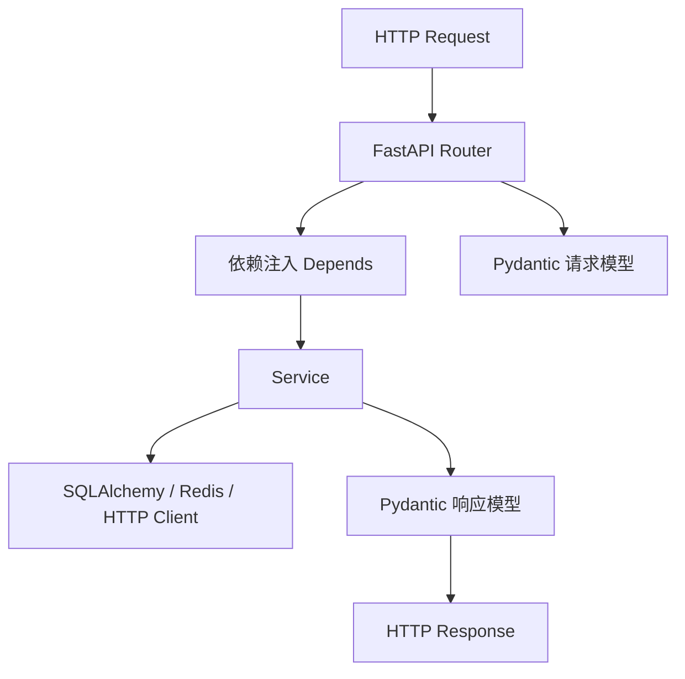
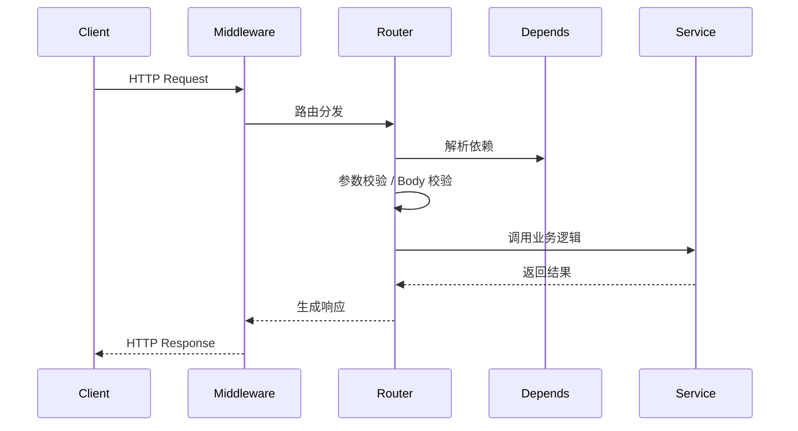
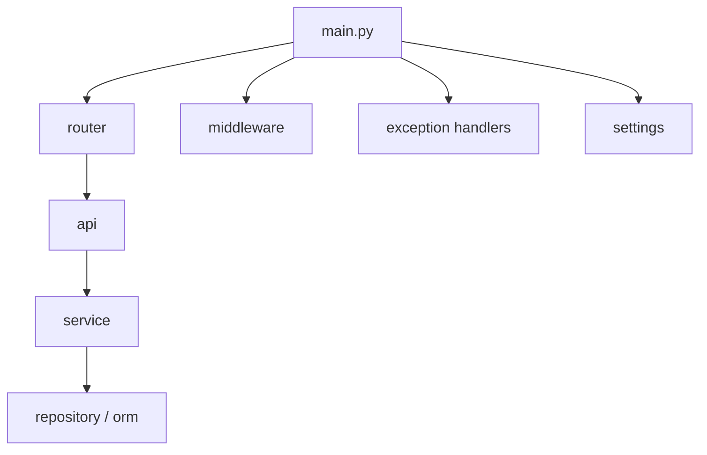
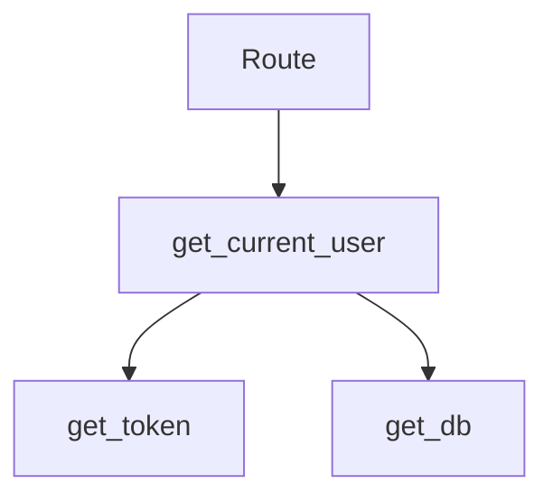
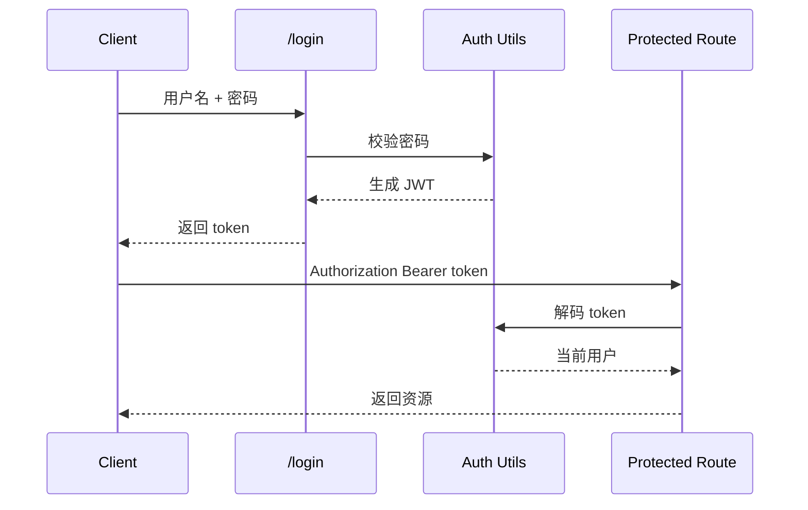
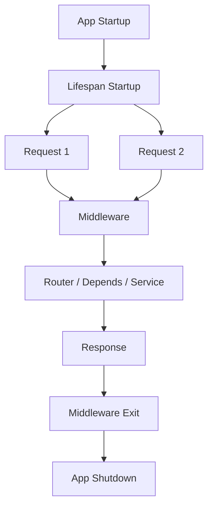
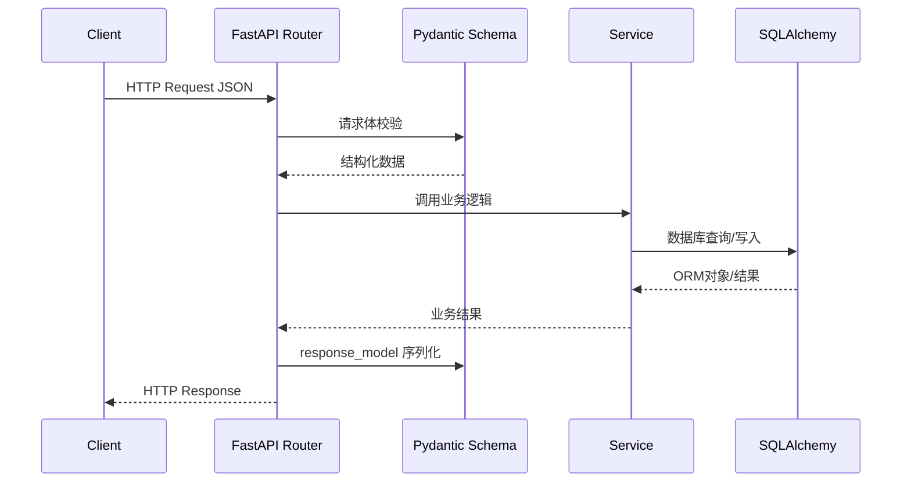

# FastAPI 使用指南

> 基于 FastAPI 官方文档整理，面向实际后端项目开发。  
> 官方文档入口：
> - https://fastapi.tiangolo.com/
> - https://fastapi.tiangolo.com/tutorial/
> - https://fastapi.tiangolo.com/advanced/
> - https://fastapi.tiangolo.com/deployment/

## 1. FastAPI 是什么

FastAPI 是一个现代 Python Web 框架，核心特点是：

- 基于类型标注
- 自动参数校验
- 自动生成 OpenAPI 文档
- 原生支持异步
- 与 Pydantic 深度集成

一句话理解：

> FastAPI = Starlette 负责 Web 能力 + Pydantic 负责数据校验和文档建模。

## 2. FastAPI 架构图



## 3. FastAPI 和 Starlette、Pydantic 的关系

FastAPI 自己并不是从零写出来的。

- Starlette
  - 负责 ASGI、路由、中间件、请求响应、WebSocket、后台任务
- Pydantic
  - 负责数据解析、校验、序列化、文档 schema
- FastAPI
  - 把这两者整合起来，提供更适合 API 开发的接口

## 4. 什么时候适合用 FastAPI

适合：

- 
- 1.
  “最实用的 10 个高级 FastAPI 模式”
  2.
  “结合你这个项目，哪些高级能力最值得补”
  3.
  “每个高级能力给一段最小可运行示例代码”
- API 项目
- 前后端分离后端
- 微服务
- 内部平台接口
- 需要 OpenAPI 文档的系统
- 需要异步 I/O 的服务

不一定最优：

- 纯服务端模板渲染网站
- 团队完全不使用类型标注
- 对异步和依赖注入理解很弱的小团队

## 5. 基本安装

```bash
pip install fastapi uvicorn
```

常见组合：

```bash
pip install fastapi uvicorn[standard]
```

## 6. 第一个 FastAPI 应用

```python
from fastapi import FastAPI

app = FastAPI()


@app.get("/")
async def root():
    return {"message": "hello"}
```

启动：

```bash
uvicorn main:app --reload
```

## 7. `FastAPI()` 初始化参数

```python
app = FastAPI(
    title="Demo API",
    description="接口文档示例",
    version="1.0.0",
    docs_url="/docs",
    redoc_url="/redoc",
    openapi_url="/openapi.json",
)
```

常见参数含义：

- `title`
  - 文档标题
- `description`
  - 文档描述
- `version`
  - 版本号
- `docs_url`
  - Swagger 地址
- `redoc_url`
  - ReDoc 地址
- `openapi_url`
  - OpenAPI JSON 地址

## 8. 请求处理生命周期



## 9. 路由定义

### 9.1 GET

```python
@app.get("/users")
async def user_list():
    return []
```

### 9.2 POST

```python
@app.post("/users")
async def create_user():
    return {"ok": True}
```

### 9.3 PUT

```python
@app.put("/users/{user_id}")
async def update_user(user_id: int):
    return {"user_id": user_id}
```

### 9.4 DELETE

```python
@app.delete("/users/{user_id}")
async def delete_user(user_id: int):
    return {"user_id": user_id}
```

## 10. 请求参数分类

FastAPI 参数主要有 4 类：

- Path 参数
- Query 参数
- Body 参数
- Header / Cookie / Form / File

### 10.1 Path 参数

```python
@app.get("/users/{user_id}")
async def get_user(user_id: int):
    return {"user_id": user_id}
```

### 10.2 Query 参数

```python
@app.get("/users")
async def user_list(page: int = 1, size: int = 20):
    return {"page": page, "size": size}
```

### 10.3 Body 参数

```python
from pydantic import BaseModel


class UserCreate(BaseModel):
    username: str
    email: str


@app.post("/users")
async def create_user(data: UserCreate):
    return data
```

### 10.4 混合参数

```python
@app.put("/users/{user_id}")
async def update_user(user_id: int, force: bool = False, data: UserCreate | None = None):
    return {"user_id": user_id, "force": force, "data": data}
```

## 11. `Query`、`Path`、`Body`

它们是参数声明工具，用于补充约束和文档信息。

```python
from fastapi import Query, Path, Body


@app.get("/users/{user_id}")
async def get_user(
    user_id: int = Path(..., ge=1, description="用户ID"),
    detail: bool = Query(False, description="是否返回详情"),
):
    return {"user_id": user_id, "detail": detail}
```

Body 示例：

```python
@app.post("/users")
async def create_user(
    data: UserCreate = Body(..., description="用户创建数据"),
):
    return data
```

## 12. Pydantic 与 FastAPI 的协作

FastAPI 的核心体验很大一部分来自 Pydantic。

Pydantic 在 FastAPI 中主要负责：

- 请求体校验
- 查询模型校验
- 响应模型序列化
- OpenAPI schema 生成

## 13. `response_model`

```python
class UserVO(BaseModel):
    id: int
    username: str


@app.get("/users/{user_id}", response_model=UserVO)
async def get_user(user_id: int):
    return {"id": user_id, "username": "tom", "password": "secret"}
```

作用：

- 约束响应结构
- 自动过滤多余字段
- 改善文档展示

## 14. 状态码和响应信息

```python
from fastapi import status


@app.post("/users", status_code=status.HTTP_201_CREATED)
async def create_user(data: UserCreate):
    return {"ok": True}
```

补充响应信息：

```python
@app.get(
    "/users/{user_id}",
    responses={404: {"description": "用户不存在"}},
)
async def get_user(user_id: int):
    ...
```

## 15. `APIRouter`

项目中不要所有接口都写在一个文件里，通常会用 `APIRouter` 拆模块。

```python
from fastapi import APIRouter

router = APIRouter(prefix="/users", tags=["users"])


@router.get("/")
async def user_list():
    return []
```

主应用挂载：

```python
app.include_router(router)
```

## 16. 项目结构建议



推荐目录：

```text
app/
  api/
    user_api.py
    auth_api.py
  service/
    user_service.py
  models/
    user.py
  schemas/
    user.py
  middleware/
    request_log.py
  exception/
    handlers.py
  config/
    settings.py
  main.py
```

## 17. 依赖注入 `Depends`

这是 FastAPI 最核心的能力之一。

### 17.1 基本例子

```python
from fastapi import Depends


def common_query(page: int = 1, size: int = 20):
    return {"page": page, "size": size}


@app.get("/users")
async def user_list(params=Depends(common_query)):
    return params
```

### 17.2 常见用途

- 数据库 Session
- 当前登录用户
- 分页参数
- 权限校验
- 公共配置

### 17.3 依赖图

```mermaid
flowchart LR
    A[Request] --> B[Router]
    B --> C[Depends(get_db)]
    B --> D[Depends(get_current_user)]
    C --> E[AsyncSession]
    D --> F[User]
```

## 18. 数据库依赖

```python
from collections.abc import AsyncGenerator
from sqlalchemy.ext.asyncio import AsyncSession


async def get_db() -> AsyncGenerator[AsyncSession, None]:
    async with AsyncSessionLocal() as session:
        try:
            yield session
        finally:
            await session.close()
```

接口中：

```python
@app.get("/users")
async def user_list(db: AsyncSession = Depends(get_db)):
    ...
```

## 19. 生命周期 `lifespan`

FastAPI 现在更推荐使用 `lifespan`，而不是旧的 `@app.on_event("startup")`。

```python
from contextlib import asynccontextmanager
from fastapi import FastAPI


@asynccontextmanager
async def lifespan(app: FastAPI):
    print("startup")
    yield
    print("shutdown")


app = FastAPI(lifespan=lifespan)
```

适用场景：

- 初始化日志
- 初始化数据库连接
- 初始化 Redis
- 加载模型
- 资源释放

## 20. 中间件

中间件适合处理“所有请求都要做的事情”。

例如：

- 请求日志
- 链路 ID
- CORS
- 统一耗时统计
- 安全头

### 20.1 自定义中间件

```python
from starlette.middleware.base import BaseHTTPMiddleware
from fastapi import Request


class RequestLogMiddleware(BaseHTTPMiddleware):
    async def dispatch(self, request: Request, call_next):
        response = await call_next(request)
        response.headers["X-Demo"] = "ok"
        return response
```

注册：

```python
app.add_middleware(RequestLogMiddleware)
```

## 21. CORS

```python
from fastapi.middleware.cors import CORSMiddleware

app.add_middleware(
    CORSMiddleware,
    allow_origins=["*"],
    allow_credentials=True,
    allow_methods=["*"],
    allow_headers=["*"],
)
```

适用场景：

- 前后端分离
- 浏览器跨域访问

## 22. 异常处理

### 22.1 主动抛 HTTP 异常

```python
from fastapi import HTTPException


@app.get("/users/{user_id}")
async def get_user(user_id: int):
    if user_id <= 0:
        raise HTTPException(status_code=400, detail="invalid user id")
    return {"id": user_id}
```

### 22.2 全局异常处理器

```python
from fastapi import Request
from fastapi.responses import JSONResponse


@app.exception_handler(ValueError)
async def value_error_handler(request: Request, exc: ValueError):
    return JSONResponse(status_code=400, content={"detail": str(exc)})
```

适用场景：

- 业务异常统一输出
- 统一响应结构

## 23. 校验错误

FastAPI 请求校验失败时，通常返回 `422 Unprocessable Entity`。

原因常见有：

- 路径参数类型不匹配
- Query 参数格式不对
- Body 缺少必填字段
- Pydantic 校验失败

## 24. 响应对象

### 24.1 JSONResponse

```python
from fastapi.responses import JSONResponse


@app.get("/ping")
async def ping():
    return JSONResponse(content={"message": "pong"})
```

### 24.2 PlainTextResponse

```python
from fastapi.responses import PlainTextResponse


@app.get("/text")
async def text():
    return PlainTextResponse("hello")
```

### 24.3 FileResponse

```python
from fastapi.responses import FileResponse


@app.get("/download")
async def download():
    return FileResponse("demo.txt")
```

### 24.4 StreamingResponse

```python
from fastapi.responses import StreamingResponse


def iter_file():
    yield b"hello"


@app.get("/stream")
async def stream():
    return StreamingResponse(iter_file())
```

## 25. 后台任务

```python
from fastapi import BackgroundTasks


def write_log(msg: str):
    print(msg)


@app.post("/notify")
async def notify(background_tasks: BackgroundTasks):
    background_tasks.add_task(write_log, "send notify")
    return {"ok": True}
```

适用场景：

- 轻量异步收尾工作
- 发邮件
- 记录日志

不适合：

- 重型任务
- 长时间任务

这类应该用 Celery / RQ / MQ。

## 26. 安全和认证

### 26.1 OAuth2PasswordBearer

```python
from fastapi.security import OAuth2PasswordBearer

oauth2_scheme = OAuth2PasswordBearer(tokenUrl="/login")
```

### 26.2 获取 token

```python
from fastapi import Depends


@app.get("/me")
async def me(token: str = Depends(oauth2_scheme)):
    return {"token": token}
```

### 26.3 实战常见结构

- `login` 接口签发 JWT
- `Depends(get_current_user)` 解析用户
- 权限依赖做角色判断

## 27. 文件上传

```python
from fastapi import UploadFile, File


@app.post("/upload")
async def upload(file: UploadFile = File(...)):
    return {"filename": file.filename}
```

`UploadFile` 的好处：

- 适合大文件
- 支持异步读取

## 28. WebSocket

```python
from fastapi import WebSocket


@app.websocket("/ws")
async def websocket_endpoint(websocket: WebSocket):
    await websocket.accept()
    while True:
        data = await websocket.receive_text()
        await websocket.send_text(f"echo: {data}")
```

适用场景：

- 实时通知
- 聊天
- 实时监控

## 29. 同步和异步怎么选

### 29.1 适合 `async def`

- 数据库是异步驱动
- 有 Redis / HTTP / MQ 等多个 I/O
- 高并发 API 服务

### 29.2 适合 `def`

- 纯 CPU 逻辑
- 同步数据库驱动
- 简单脚本式接口

### 29.3 原则

如果项目整体是异步架构：

- 路由用 `async def`
- 数据库也尽量异步

不要：

- 路由异步
- 内部全是阻塞同步 I/O

## 30. FastAPI 和 SQLAlchemy / Pydantic 的协作

推荐职责分工：

- FastAPI：路由、依赖、中间件、异常、生命周期
- Pydantic：请求响应模型、配置模型
- SQLAlchemy：数据库访问和事务

## 31. 测试

FastAPI 常见测试工具：

```bash
pip install pytest httpx
```

简单例子：

```python
from fastapi.testclient import TestClient


client = TestClient(app)


def test_root():
    resp = client.get("/")
    assert resp.status_code == 200
```

如果是异步测试，常配合：

- `httpx.AsyncClient`
- `pytest-asyncio`

## 32. 部署

开发环境：

```bash
uvicorn main:app --reload
```

生产环境常见：

```bash
uvicorn main:app --host 0.0.0.0 --port 8000
```

或搭配：

- Gunicorn + Uvicorn Worker
- Docker
- Kubernetes

## 33. 常见错误

### 33.1 `422 Unprocessable Entity`

常见原因：

- 参数类型不匹配
- Body 缺字段
- 路由顺序冲突导致路径被错误匹配

### 33.2 `Error loading ASGI app`

常见原因：

- `uvicorn main:app` 写成了错误对象名
- 模块导入错误

### 33.3 依赖注入拿不到值

常见原因：

- `Depends(...)` 用错位置
- 同步异步混用
- 依赖函数本身抛异常

## 34. 性能建议

1. 响应模型只返回需要的字段
2. 数据库分页、索引、SQL 优化比框架层微调更重要
3. 高并发项目统一走异步 I/O
4. 中间件不要做重逻辑
5. 后台任务不要承担重任务
6. 大量公用逻辑尽量放依赖或 service，不要复制到路由里

## 35. 官方文档继续阅读建议

- Path / Query / Body  
  https://fastapi.tiangolo.com/tutorial/path-params/
- Dependencies  
  https://fastapi.tiangolo.com/tutorial/dependencies/
- Response Model  
  https://fastapi.tiangolo.com/tutorial/response-model/
- Middleware  
  https://fastapi.tiangolo.com/tutorial/middleware/
- Lifespan  
  https://fastapi.tiangolo.com/advanced/events/
- Security  
  https://fastapi.tiangolo.com/tutorial/security/
- WebSockets  
  https://fastapi.tiangolo.com/advanced/websockets/

## 36. 这份文档解决什么问题

这份文档重点解决的是：

- FastAPI 在项目里扮演什么角色
- 路由、依赖、Pydantic、SQLAlchemy 怎么协作
- 请求参数该怎么分层处理
- 生命周期、中间件、异常处理放哪里
- 什么时候该异步，什么时候不用强上异步
- 一个正常的项目结构应该怎么搭

如果你还要继续扩这份文档，后续最值得单独拆专题的是：

1. 依赖注入专题
2. 安全认证专题
3. 生命周期和中间件专题
4. FastAPI 测试专题
5. FastAPI + SQLAlchemy + Pydantic 整体工程实践专题

## 37. 依赖注入专题

依赖注入是 FastAPI 最核心、最有辨识度的能力之一。  
很多人第一次接触时会觉得“只是把函数套一层 `Depends`”，但它真正解决的是：

- 公共逻辑复用
- 资源生命周期管理
- 权限与上下文注入
- 路由层和业务层解耦

### 37.1 为什么需要依赖注入

假设没有依赖注入，一个接口可能会变成这样：

```python
@app.get("/users")
async def user_list():
    db = AsyncSessionLocal()
    token = ...
    current_user = ...
    page = ...
    ...
```

问题：

- 数据库获取逻辑每个接口都要写
- 登录态解析每个接口都要写
- 分页参数每个接口都要写
- 资源关闭容易忘

用了依赖注入之后：

```python
@app.get("/users")
async def user_list(
    db: AsyncSession = Depends(get_db),
    current_user: User = Depends(get_current_user),
    page: PageQuery = Depends(),
):
    ...
```

优点是：

- 路由函数只保留“它真正需要什么”
- 公共资源由框架自动组装
- 可读性和维护性都更好

### 37.2 最基本的依赖是什么

```python
from fastapi import Depends


def common_query(page: int = 1, size: int = 20):
    return {"page": page, "size": size}


@app.get("/users")
async def user_list(params = Depends(common_query)):
    return params
```

理解方式：

- `common_query()` 是依赖函数
- `Depends(common_query)` 的意思是“这个参数的值由 FastAPI 调这个函数来提供”

### 37.3 依赖不只是“函数复用”

依赖可以注入：

- 普通值
- 数据库 Session
- 当前用户
- 配置对象
- 权限校验结果
- 请求上下文

所以可以把它理解成：

> “框架帮你自动准备路由执行所需的上下文对象。”

### 37.4 数据库依赖为什么要写成 `yield`

常见写法：

```python
from collections.abc import AsyncGenerator


async def get_db() -> AsyncGenerator[AsyncSession, None]:
    async with AsyncSessionLocal() as session:
        try:
            yield session
        finally:
            await session.close()
```

这里很多人会问：为什么不是 `return session`？

原因是：

- `yield` 可以把依赖拆成“进入”和“退出”两段
- `yield` 前：准备资源
- `yield` 后：释放资源

也就是说，FastAPI 会：

1. 先执行到 `yield`
2. 把 `session` 注入给路由
3. 路由执行完成后，再执行 `yield` 后面的清理逻辑

这就很适合：

- 数据库连接
- 文件句柄
- 临时上下文
- 事务控制

### 37.5 多层依赖

依赖还可以依赖其他依赖。

例如：

```python
async def get_token(token: str = Depends(oauth2_scheme)) -> str:
    return token


async def get_current_user(
    token: str = Depends(get_token),
    db: AsyncSession = Depends(get_db),
):
    ...
```

这说明依赖本身也可以形成链条。

理解成一棵树更合适：



### 37.6 什么时候适合做成依赖

适合做依赖的内容：

- 公共参数
- 登录态用户
- 权限检查
- 数据库 Session
- 公共配置
- 请求级上下文

不适合做依赖的内容：

- 很重的业务逻辑
- 特别复杂的流程编排
- 与单个接口强耦合的一次性逻辑

### 37.7 依赖注入的边界

这点非常重要。

依赖注入适合“准备上下文”，不适合“承载全部业务”。

比如：

- `get_db()` 适合做依赖
- `get_current_user()` 适合做依赖
- “创建订单、扣库存、发通知”不适合做依赖

后者应该在 Service 层处理。

### 37.8 依赖缓存

同一个请求内，如果同一个依赖被复用，FastAPI 默认会缓存依赖结果。

这意味着：

- 一个请求内多处 `Depends(get_db)`，通常不会重复创建多份资源

这对数据库 Session 很重要，因为它能保证：

- 同一个请求尽量共享同一份 Session

### 37.9 常见坑

1. 把重业务逻辑塞进依赖
2. 依赖里直接吞异常
3. 同步异步依赖混用混乱
4. 忘记在 `yield` 后释放资源
5. 误以为依赖等同于 Service

## 38. 安全认证专题

FastAPI 的安全认证能力主要是“帮你把认证流程结构化”，不是直接替你完成业务认证。

简单说：

- FastAPI 提供认证相关工具
- 你仍然要自己定义 token 逻辑、用户查找逻辑、权限规则

### 38.1 认证和授权的区别

这是必须先分清的。

- 认证 Authentication
  - 你是谁
- 授权 Authorization
  - 你能做什么

例如：

- 登录成功，说明认证通过
- 登录后是否能访问管理接口，说明授权是否通过

### 38.2 最基础的 Bearer Token

```python
from fastapi.security import OAuth2PasswordBearer

oauth2_scheme = OAuth2PasswordBearer(tokenUrl="/login")
```

它的作用不是“自动登录”，而是：

- 从请求头里解析 `Authorization: Bearer xxx`
- 把 token 提供给依赖函数

### 38.3 获取 token

```python
from fastapi import Depends


@app.get("/me")
async def me(token: str = Depends(oauth2_scheme)):
    return {"token": token}
```

这里的 `token` 只是“从头里解析出来的字符串”，还不是“当前用户对象”。

### 38.4 完整认证链路

实际项目一般是这样：



### 38.5 `get_current_user`

这通常才是项目里真正关键的认证依赖。

```python
from fastapi import Depends, HTTPException


async def get_current_user(
    token: str = Depends(oauth2_scheme),
    db: AsyncSession = Depends(get_db),
):
    user_id = decode_token(token)
    user = await UserService.get_by_id(db, user_id)
    if not user:
        raise HTTPException(status_code=401, detail="invalid token")
    return user
```

这样路由里就可以直接拿当前用户对象：

```python
@app.get("/me")
async def me(current_user = Depends(get_current_user)):
    return current_user
```

### 38.6 权限依赖

进一步还可以再包一层权限检查：

```python
def require_admin(current_user = Depends(get_current_user)):
    if current_user.role != "admin":
        raise HTTPException(status_code=403, detail="forbidden")
    return current_user
```

使用：

```python
@app.get("/admin")
async def admin_page(current_user = Depends(require_admin)):
    return {"ok": True}
```

### 38.7 什么时候适合 JWT

适合：

- 前后端分离
- 多服务系统
- 无状态认证

不一定适合：

- 非常简单的后台系统
- 强依赖服务端会话的场景

### 38.8 安全设计建议

1. Access Token 和 Refresh Token 分开
2. token 解码失败统一返回 401
3. 权限不足统一返回 403
4. 密码必须做哈希，不要明文存储
5. 不要把权限判断写死在路由函数里到处复制

## 39. 生命周期和中间件专题

这两个概念非常容易混，但它们解决的问题不一样。

### 39.1 生命周期是什么

生命周期处理的是：

- 应用启动时做什么
- 应用关闭时做什么

典型场景：

- 初始化日志
- 连接 Redis
- 预热模型
- 加载配置
- 优雅释放资源

### 39.2 `lifespan` 为什么取代 `@app.on_event`

旧写法：

```python
@app.on_event("startup")
async def startup():
    ...
```

新推荐写法：

```python
from contextlib import asynccontextmanager


@asynccontextmanager
async def lifespan(app: FastAPI):
    ...
    yield
    ...
```

为什么新写法更好：

- 启动和关闭逻辑在一个上下文里
- 更容易管理成对资源
- 更符合现代 ASGI 应用风格

### 39.3 生命周期适合做什么，不适合做什么

适合：

- 初始化资源
- 注册监控
- 启动全局对象

不适合：

- 处理单个请求逻辑
- 做请求鉴权
- 做每个请求的日志

这些应该是中间件的事。

### 39.4 中间件是什么

中间件处理的是：

- 每个请求进来时做什么
- 每个请求返回前做什么

它是“请求级横切逻辑”。

### 39.5 中间件适合做什么

适合：

- 请求日志
- request id
- CORS
- 性能统计
- 统一响应头

不适合：

- 很重的业务逻辑
- 数据库事务主流程
- 复杂权限编排

### 39.6 生命周期和中间件的区别

可以这样记：

- 生命周期：应用级
- 中间件：请求级

图示：



### 39.7 一个典型组合

- 生命周期：初始化日志系统
- 中间件：给每个请求生成 request_id

这样职责就很清晰。

## 40. FastAPI 测试专题

测试不是可选项，尤其是 Web 框架项目。

FastAPI 测试重点解决的是：

- 接口是否通
- 参数校验是否正确
- 鉴权是否正确
- 依赖能否替换
- 数据库是否隔离

### 40.1 最基本测试

```python
from fastapi.testclient import TestClient


client = TestClient(app)


def test_root():
    resp = client.get("/")
    assert resp.status_code == 200
```

### 40.2 为什么 `TestClient` 好用

因为：

- 不需要真的启动服务
- 可以直接发请求
- 适合单元测试和接口测试

### 40.3 测什么

最值得测的通常有：

1. 状态码
2. 响应结构
3. 鉴权逻辑
4. 参数校验
5. 依赖覆盖

### 40.4 测试请求体校验

```python
def test_create_user_invalid():
    resp = client.post("/users", json={"username": ""})
    assert resp.status_code == 422
```

### 40.5 依赖覆盖

这是 FastAPI 测试里非常关键的一点。

```python
def override_get_db():
    yield test_session


app.dependency_overrides[get_db] = override_get_db
```

作用：

- 正式环境依赖不再使用
- 测试里替换成测试数据库、假用户、假服务

### 40.6 测试当前用户

```python
def override_get_current_user():
    return FakeUser(id=1, role="admin")


app.dependency_overrides[get_current_user] = override_get_current_user
```

这样你就能测试：

- 普通用户接口
- 管理员接口
- 未登录场景

### 40.7 异步测试

如果你项目强依赖异步，通常还会用：

- `pytest-asyncio`
- `httpx.AsyncClient`

### 40.8 测试建议

1. 单元测试和接口测试分开
2. 尽量覆盖异常路径
3. 依赖覆盖要在测试结束后清理
4. 数据库测试尽量隔离

## 41. FastAPI + SQLAlchemy + Pydantic 整体工程实践专题

这一部分讲的是“三件套怎么协作”，因为真实项目里它们几乎总是一起出现。

### 41.1 三者职责怎么分

最推荐的职责边界是：

- FastAPI
  - 路由
  - 依赖注入
  - 生命周期
  - 中间件
  - 异常处理
- Pydantic
  - 请求模型
  - 响应模型
  - 配置模型
- SQLAlchemy
  - 数据库模型
  - 查询
  - 事务
  - 持久化

### 41.2 一条请求的完整流转



### 41.3 推荐分层

#### 路由层

职责：

- 接收请求
- 注入依赖
- 调用 service
- 返回响应

不推荐在这里做：

- 大量业务规则
- 复杂数据库操作

#### Service 层

职责：

- 业务逻辑
- 调度数据库操作
- 处理流程编排

#### Schema 层

职责：

- 输入输出结构
- 参数校验

#### ORM 层

职责：

- 表结构
- 持久化模型

### 41.4 一个推荐目录

```text
app/
  api/
    user_api.py
  service/
    user_service.py
  models/
    user.py
  schemas/
    user.py
  deps/
    database.py
    auth.py
  config/
    settings.py
  middleware/
    request_log.py
  exception/
    handlers.py
  main.py
```

### 41.5 一个最典型的例子

请求模型：

```python
class UserCreate(BaseModel):
    username: str
    email: str
```

响应模型：

```python
class UserVO(BaseModel):
    model_config = ConfigDict(from_attributes=True)

    id: int
    username: str
    email: str
```

ORM 模型：

```python
class User(Base):
    __tablename__ = "sys_user"

    id: Mapped[int] = mapped_column(primary_key=True)
    username: Mapped[str]
    email: Mapped[str]
```

Service：

```python
class UserService:
    @staticmethod
    async def create_user(db: AsyncSession, data: UserCreate) -> User:
        user = User(username=data.username, email=data.email)
        db.add(user)
        await db.commit()
        await db.refresh(user)
        return user
```

Route：

```python
@router.post("/users", response_model=UserVO)
async def create_user(data: UserCreate, db: AsyncSession = Depends(get_db)):
    return await UserService.create_user(db, data)
```

### 41.6 为什么这套分工合理

因为它满足：

- 输入由 Pydantic 负责
- 存储由 SQLAlchemy 负责
- 调度由 FastAPI 和 Service 负责

这样每层边界比较清楚，不容易互相污染。

### 41.7 最常见的错误分层

错误一：

- 在 Pydantic schema 里写业务逻辑

错误二：

- 在路由里直接写全部数据库操作

错误三：

- 把 SQLAlchemy ORM 模型直接当响应模型返回而不做响应约束

错误四：

- 配置、依赖、权限逻辑散落在各个接口里

### 41.8 最值得坚持的工程原则

1. 路由层保持薄
2. Schema 只管输入输出
3. Service 管业务流程
4. ORM 管持久化
5. 依赖注入只准备上下文，不承载重业务

## 42. 值得补充的高级实践

前面的内容已经覆盖了 FastAPI 的主干能力。  
如果项目开始走向中大型、多人协作、长期维护，下面这些能力就值得补进团队文档：

- 依赖注入的工程化写法
- 自定义 `APIRoute`
- OpenAPI 深度定制
- 流式响应与 SSE
- 子应用挂载与 API 版本化
- 插件化设计
- 更偏架构治理的工程实践

这些内容的共同特点是：

- 不只是“会不会用 FastAPI”
- 而是“能不能把 FastAPI 用成一个可维护、可扩展的后端骨架”

## 43. 依赖注入的工程化写法

前面已经讲过 `Depends` 的基本用法。  
更进一步的实践重点不是“还能不能再套一层 Depends”，而是：

- 如何让依赖更清晰
- 如何让路由签名更稳定
- 如何让公共上下文可复用

### 43.1 用 `Annotated` 给依赖起别名

当项目里数据库、当前用户、管理员用户、租户上下文等依赖越来越多时，重复写：

```python
db: AsyncSession = Depends(get_db)
current_user: User = Depends(get_current_user)
```

会让函数签名越来越长。

这时可以配合 `Annotated`：

```python
from typing import Annotated

DbSession = Annotated[AsyncSession, Depends(get_db)]
CurrentUser = Annotated[User, Depends(get_current_user)]
AdminUser = Annotated[User, Depends(require_admin)]
```

路由里就可以写成：

```python
@router.get("/users")
async def user_list(db: DbSession, current_user: AdminUser):
    ...
```

好处：

- 签名更干净
- 类型信息更明确
- 团队可以统一依赖命名

### 43.2 把依赖拆成“资源依赖、身份依赖、参数依赖”

比较推荐的分类方式：

- 资源依赖
  - `get_db`
  - `get_redis`
  - `get_http_client`
- 身份依赖
  - `get_token`
  - `get_current_user`
  - `require_admin`
- 参数依赖
  - `PageQuery`
  - `OrderFilter`
  - `CommonHeaders`

这样做的意义在于：

- 路由层更容易读
- 依赖职责更容易收敛
- 不容易把业务逻辑误塞进依赖里

### 43.3 依赖只准备上下文，不承载重业务

依赖适合做：

- 取数据库 Session
- 解析 token
- 注入当前用户
- 提供分页对象
- 做轻量权限检查

依赖不适合做：

- 下单主流程
- 扣库存
- 发通知
- 大量数据库写操作编排

原因很简单：

- 依赖的职责是“准备路由执行所需上下文”
- Service 的职责才是“承载业务流程”

## 44. 自定义 `APIRoute`

中间件适合做全局请求级逻辑。  
但有些需求更靠近路由执行阶段，这时可以自定义 `APIRoute`。

适合场景：

- 统计单个路由耗时
- 路由级审计
- 统一包装部分接口响应
- 对路由参数解析做扩展

示例：

```python
import time
from fastapi.routing import APIRoute


class TimedRoute(APIRoute):
    def get_route_handler(self):
        original_handler = super().get_route_handler()

        async def custom_handler(request):
            start = time.time()
            response = await original_handler(request)
            response.headers["X-Response-Time"] = str(time.time() - start)
            return response

        return custom_handler
```

使用：

```python
router = APIRouter(route_class=TimedRoute)
```

和中间件相比，这种方式的特点是：

- 更接近路由执行点
- 更适合对某一组接口单独增强
- 不必把所有逻辑都做成全局中间件

## 45. OpenAPI 深度定制

FastAPI 会自动生成文档，但在实际项目里，很多时候需要“定制文档”，而不是只接受默认结果。

常见需求：

- 自定义文档标题和说明
- 增加统一错误码说明
- 描述统一认证方式
- 给内部接口和外部接口生成不同文档
- 标记某些接口废弃

自定义 `openapi` 的基本写法：

```python
from fastapi.openapi.utils import get_openapi


def custom_openapi():
    if app.openapi_schema:
        return app.openapi_schema

    openapi_schema = get_openapi(
        title="Demo API",
        version="1.0.0",
        description="内部接口文档",
        routes=app.routes,
    )
    openapi_schema["info"]["x-logo"] = {
        "url": "https://example.com/logo.png"
    }
    app.openapi_schema = openapi_schema
    return app.openapi_schema


app.openapi = custom_openapi
```

这个能力适合：

- 对外开放 API
- 平台类系统
- 需要 SDK 生成的项目

因为这时 OpenAPI 不只是“文档”，还是“接口契约”。

## 46. 流式响应与 SSE

普通 JSON 接口适合一次性返回完整结果。  
但有些场景更适合边生成边返回：

- 日志流
- 任务进度
- AI 输出流
- 实时通知

这时可以使用 `StreamingResponse` 或 `SSE`。

### 46.1 `StreamingResponse`

```python
from fastapi.responses import StreamingResponse


async def event_stream():
    for i in range(5):
        yield f"chunk-{i}\n"


@app.get("/stream")
async def stream():
    return StreamingResponse(event_stream(), media_type="text/plain")
```

适合：

- 大文件分块传输
- 长结果流式输出
- 避免一次性拼完整大响应

### 46.2 SSE

如果前端希望通过标准 HTTP 长连接持续接收事件，常用 `text/event-stream`：

```python
from fastapi.responses import StreamingResponse


async def sse_stream():
    for i in range(5):
        yield f"data: message-{i}\n\n"


@app.get("/events")
async def events():
    return StreamingResponse(sse_stream(), media_type="text/event-stream")
```

适合：

- 管理后台实时刷新
- 轻量服务端推送
- 不想引入 WebSocket 的单向通知场景

## 47. 子应用挂载与 API 版本化

小项目通常直接 `include_router`。  
但当系统越来越复杂时，可能需要多个相对独立的接口区域。

例如：

- 公共 API
- 管理后台 API
- 内部运维 API
- 不同版本 API

这时可以考虑子应用挂载：

```python
main_app.mount("/admin", admin_app)
main_app.mount("/public", public_app)
```

好处：

- 每个子应用可以有独立文档
- 可以有不同中间件策略
- 不同模块之间边界更清晰

版本化方面，常见做法：

- `/api/v1`
- `/api/v2`

推荐思路：

- 不同版本路由分开
- 不同版本 schema 分开
- Service 尽量共享

注意：

- 版本化不只是改 URL
- 还包括字段兼容、废弃策略、客户端迁移成本

## 48. 插件化设计

插件化的目标不是“为了高级而高级”，而是让系统可以按模块扩展、启用、停用和治理。

适合场景：

- 模块很多
- 需要按环境启用不同功能
- 需要按租户开关能力
- 多团队并行交付模块

### 48.1 插件本质上是什么

在 FastAPI 项目里，插件通常首先是一个 Python 模块包，而不是先从 SDK 角度理解。

可以理解为：

> 插件 = 一组代码 + 一份统一协议 + 一套加载机制

一个插件通常包含：

- 路由
- 配置
- 初始化逻辑
- 元信息
- 可选的权限定义

### 48.2 插件常见的几种形式

最常见的形式有三类：

- 项目内模块
  - 例如 `app/plugins/report/`
- 独立 Python 包
  - 通过 `pip install` 安装
- 能力型 SDK
  - 只提供客户端或工具类，不直接注册路由

要区分：

- SDK 更像“能力复用包”
- 插件更像“可被主程序加载的业务模块”

### 48.3 一个最小插件应该暴露什么

建议至少统一这些入口：

- `name`
- `version`
- `router`
- `enabled(settings)`
- `setup(app)`
- `teardown(app)`

示例：

```python
from dataclasses import dataclass
from fastapi import APIRouter, FastAPI


router = APIRouter(prefix="/reports", tags=["reports"])


@router.get("/")
async def report_list():
    return {"items": []}


@dataclass
class Plugin:
    name: str
    version: str
    router: APIRouter

    def enabled(self, settings) -> bool:
        return True

    async def setup(self, app: FastAPI) -> None:
        pass

    async def teardown(self, app: FastAPI) -> None:
        pass


plugin = Plugin(
    name="report",
    version="1.0.0",
    router=router,
)
```

### 48.4 主项目怎么加载插件

主项目一般分三步：

1. 发现插件
2. 动态导入插件
3. 注册路由并调用生命周期钩子

例如：

```python
from importlib import import_module


PLUGIN_PATHS = [
    "app.plugins.report.plugin",
    "app.plugins.audit.plugin",
]


def load_plugins():
    plugins = []
    for path in PLUGIN_PATHS:
        module = import_module(path)
        plugins.append(module.plugin)
    return plugins
```

注册：

```python
plugins = load_plugins()

for plugin in plugins:
    if plugin.enabled(settings):
        app.include_router(plugin.router)
```

### 48.5 插件什么时候适合独立成包

适合独立成 Python package 的情况：

- 需要多个项目复用
- 版本需要独立演进
- 有明确维护边界
- 与主项目耦合较低

如果还只是单项目内部模块化，通常先做项目内插件就足够。

### 48.6 插件化的边界

插件化解决的是：

- 模块怎么接入
- 模块怎么加载
- 模块怎么启停

插件化不自动解决：

- 模块内部混乱
- 业务边界不清
- 权限设计失控

所以插件化只是“外层组织方式”，不是内部架构质量的替代品。

## 49. 更偏架构治理的工程实践

这些内容严格来说已经不只是 FastAPI 语法，而是 FastAPI 项目成熟后必须面对的工程问题。

### 49.1 路由层保持薄

路由层应该负责：

- 接收请求
- 注入依赖
- 调用 Service
- 返回响应

不应该负责：

- 大段业务逻辑
- 复杂事务编排
- 到处写 SQL
- 到处拼权限判断

推荐状态是：

- 路由负责边界
- Service 负责流程
- Repository 负责数据访问

### 49.2 DTO / VO / Entity 分离

不要让一个模型同时承担：

- 请求输入
- 数据库存储
- 响应输出

推荐拆分：

- `CreateDTO`
- `UpdateDTO`
- `QueryDTO`
- `VO`
- ORM Entity

这样做的好处：

- 输入输出边界清晰
- 不容易泄露内部字段
- 版本演进更稳定

### 49.3 统一异常与错误码体系

项目一大，如果所有错误都手写 `HTTPException`，会很快失控。

更成熟的方式是：

- 定义业务异常基类
- 给异常配错误码
- 全局异常处理器统一输出

示例思路：

```python
class BizError(Exception):
    def __init__(self, code: str, message: str, status_code: int = 400):
        self.code = code
        self.message = message
        self.status_code = status_code
```

统一处理器输出：

```python
{
    "code": "USER_NOT_FOUND",
    "message": "用户不存在"
}
```

这样更适合：

- 前后端协作
- 日志聚合
- 接口文档沉淀

### 49.4 权限要分层，而不是散落在路由里

权限通常至少分三层：

- 认证
  - 你是谁
- 授权
  - 你能否访问某接口
- 数据权限
  - 你能看到哪些数据

推荐思路：

- 依赖负责拿当前用户
- 依赖负责做粗粒度入口校验
- Service 负责资源级权限
- Repository 负责数据范围过滤

### 49.5 事务边界和副作用边界要清楚

常见错误是：

- router 随意提交事务
- repository 自己决定提交
- 主流程里同步塞满各种副作用

更合理的做法是：

- Service 决定事务边界
- Repository 只做数据操作
- 非核心副作用尽量通过任务或事件解耦

例如用户注册后：

- 创建用户是主事务
- 发欢迎消息、打埋点、建默认资料可以异步处理

### 49.6 可观测性应该前置考虑

实际生产里，成熟的 FastAPI 项目通常需要：

- 结构化日志
- `request_id`
- `trace_id`
- 慢请求监控
- 错误聚合
- 关键指标暴露

因为真正上线后最重要的问题不是：

- “这个接口能不能跑”

而是：

- “这个接口为什么慢”
- “为什么突然报错”
- “这次调用链路经过了哪些服务”

## 50. 什么时候值得引入这些高级实践

如果项目已经出现下面这些信号，就说明这些内容值得进入团队文档：

- `main.py` 或路由注册文件越来越大
- 路由函数越来越长
- 鉴权和权限判断到处复制
- 模块增多后接入成本越来越高
- 不同客户需要不同功能组合
- 文档和接口契约开始变得重要
- 团队开始多人并行开发

反过来说，如果项目还很小，也不要为了“高级”而一次性全上。

比较稳妥的引入顺序通常是：

1. 先把依赖、Service、Schema、ORM 边界理顺
2. 再补统一异常、权限、事务治理
3. 再考虑版本化、插件化、文档深度定制

这样演进成本会更低，也更符合真实项目发展节奏。
