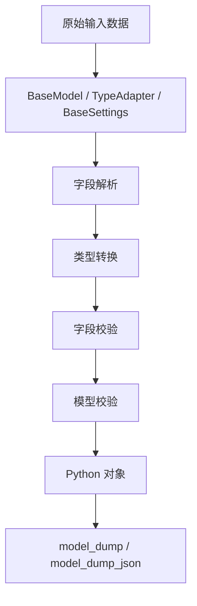
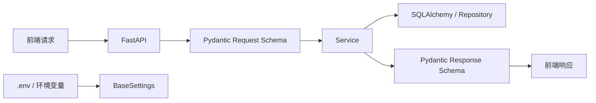
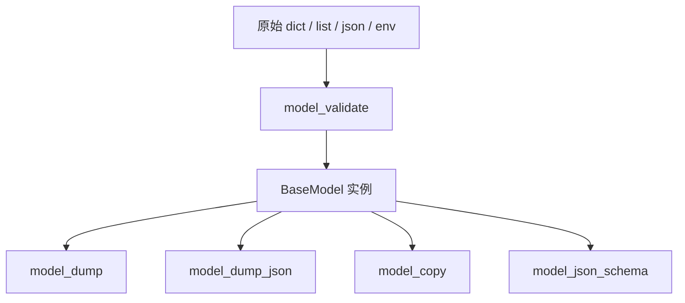
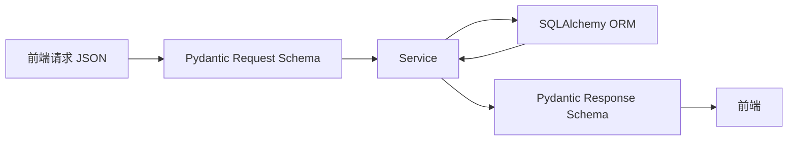
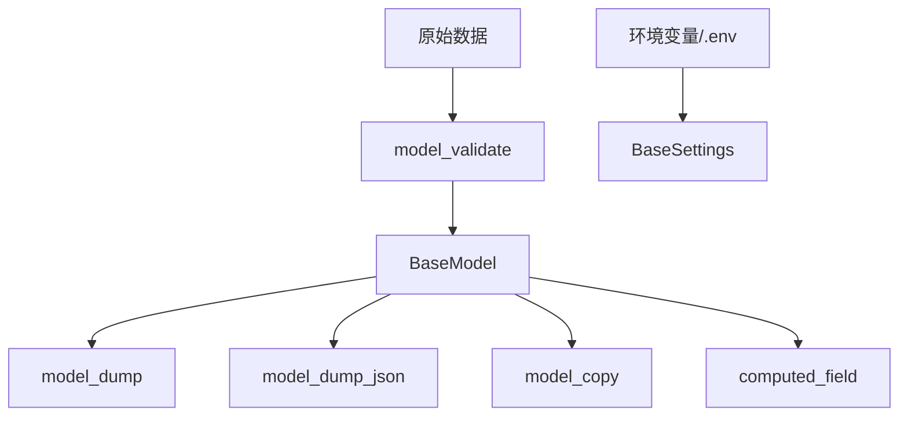
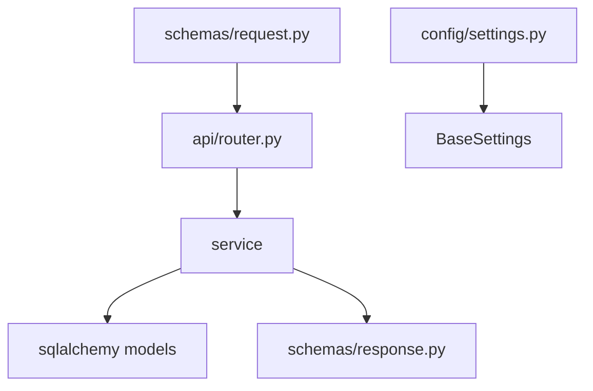

# Pydantic 使用指南

> 基于 Pydantic v2 和 `pydantic-settings` 官方文档整理，面向 FastAPI 和后端项目。  
> 官方文档入口：
> - https://docs.pydantic.dev/
> - https://docs.pydantic.dev/latest/concepts/models/
> - https://docs.pydantic.dev/latest/concepts/fields/
> - https://docs.pydantic.dev/latest/concepts/validators/
> - https://docs.pydantic.dev/latest/concepts/serialization/
> - https://docs.pydantic.dev/latest/concepts/settings/

## 1. 先建立整体认知

Pydantic 的核心作用不是“定义类”，而是：

- 数据解析
- 数据校验
- 数据转换
- 数据序列化
- 配置加载

一句话理解：

> 你把一份“不确定格式”的输入数据交给 Pydantic，它帮你变成“结构清晰、类型明确、规则受控”的 Python 对象。

常见输入来源：

- 前端请求体
- 查询参数
- 数据库查询结果
- 配置文件
- 环境变量
- 第三方接口返回值
- 消息队列消息

## 2. Pydantic 解决什么问题

没有 Pydantic 时，后端代码经常会变成这样：

```python
data = {"id": "1", "username": "tom"}

user_id = int(data["id"])
username = data.get("username")

if not username:
    raise ValueError("username is required")
```

问题：

- 校验逻辑到处散落
- 类型转换重复写
- 错误信息不统一
- 维护成本高

用了 Pydantic 后：

```python
from pydantic import BaseModel


class User(BaseModel):
    id: int
    username: str


user = User.model_validate({"id": "1", "username": "tom"})
```

Pydantic 自动帮你做了：

- `id` 从字符串转成整数
- 字段存在性校验
- 类型校验
- 结构化错误输出

## 3. Pydantic 架构图



## 4. Pydantic 在项目中的典型位置



Pydantic 在项目里通常承担三类职责：

1. 请求模型
2. 响应模型
3. 配置模型

## 5. 什么时候适合用 Pydantic

适合：

- 接口入参校验
- 接口响应格式约束
- 配置集中管理
- DTO / VO / Schema 层
- 第三方返回值标准化

不适合：

- 替代 ORM 模型
- 承担数据库持久化逻辑
- 用作复杂业务服务对象

## 6. BaseModel 是什么

`BaseModel` 是 Pydantic 的核心基类。

你继承它之后，Pydantic 会给这个类增加：

- 自动解析
- 自动校验
- 自动序列化
- 统一错误信息

最基本例子：

```python
from pydantic import BaseModel


class User(BaseModel):
    id: int
    username: str
    email: str | None = None
```

使用：

```python
user = User(id="1", username="tom")
print(user.id)        # 1
print(type(user.id))  # int
```

## 7. 字段定义

### 7.1 基本字段

```python
class User(BaseModel):
    id: int
    username: str
    age: int | None = None
```

解释：

- `id: int`
  - 必填字段
- `age: int | None = None`
  - 可空，可不传，默认值是 `None`

### 7.2 默认值

```python
class User(BaseModel):
    is_active: bool = True
```

### 7.3 `Field()`

```python
from pydantic import BaseModel, Field


class User(BaseModel):
    username: str = Field(..., min_length=3, max_length=20, description="用户名")
    age: int = Field(18, ge=0, le=150, description="年龄")
```

`Field()` 的常见作用：

- 设置默认值
- 设置范围限制
- 设置长度限制
- 设置描述
- 设置别名
- 设置示例

### 7.4 常见字段约束

```python
class Product(BaseModel):
    name: str = Field(..., min_length=1, max_length=100)
    price: float = Field(..., gt=0)
    stock: int = Field(0, ge=0)
```

常见参数：

- `gt`
- `ge`
- `lt`
- `le`
- `min_length`
- `max_length`
- `pattern`

## 8. 字段别名和前后端映射

### 8.1 单字段别名

```python
from pydantic import BaseModel, Field, ConfigDict


class PageRequest(BaseModel):
    model_config = ConfigDict(populate_by_name=True)

    page_size: int = Field(20, alias="pageSize")
    page_index: int = Field(1, alias="pageIndex")
```

含义：

- 前端可以传 `pageSize`
- Python 代码里还是用 `page_size`

### 8.2 自动驼峰

```python
from pydantic import BaseModel, ConfigDict


def to_camel(s: str) -> str:
    parts = s.split("_")
    return parts[0] + "".join(word.capitalize() for word in parts[1:])


class PageRequest(BaseModel):
    model_config = ConfigDict(
        alias_generator=to_camel,
        populate_by_name=True,
    )

    page_size: int = 20
    page_index: int = 1
```

## 9. 模型方法都是什么含义

这是很多人最容易混淆的一部分。

### 9.1 `model_validate()`

```python
user = User.model_validate({"id": "1", "username": "tom"})
```

含义：

- 从原始数据构造并校验模型
- v2 推荐写法

### 9.2 `model_dump()`

```python
data = user.model_dump()
```

含义：

- 把模型转成 Python 字典

### 9.3 `model_dump_json()`

```python
json_str = user.model_dump_json()
```

含义：

- 把模型转成 JSON 字符串

### 9.4 `model_copy()`

```python
new_user = user.model_copy(update={"username": "jack"})
```

含义：

- 复制当前模型
- 可以顺手覆盖部分字段

### 9.5 `model_json_schema()`

```python
schema = User.model_json_schema()
```

含义：

- 导出 JSON Schema
- FastAPI 文档底层会大量依赖它

### 9.6 `model_fields`

```python
print(User.model_fields)
```

含义：

- 查看模型字段定义信息

## 10. 方法关系图



## 11. 校验器

Pydantic v2 主要推荐两类校验器：

- `field_validator`
- `model_validator`

### 11.1 字段校验器

```python
from pydantic import BaseModel, field_validator


class User(BaseModel):
    username: str

    @field_validator("username")
    @classmethod
    def validate_username(cls, value: str) -> str:
        value = value.strip()
        if len(value) < 3:
            raise ValueError("username length must be at least 3")
        return value
```

适用场景：

- 单字段格式处理
- 字段清洗
- 单字段业务校验

### 11.2 多字段校验器

```python
from pydantic import BaseModel, model_validator


class PasswordForm(BaseModel):
    password: str
    confirm_password: str

    @model_validator(mode="after")
    def validate_passwords(self):
        if self.password != self.confirm_password:
            raise ValueError("passwords do not match")
        return self
```

适用场景：

- 两个字段联动
- 一个字段依赖另一个字段

### 11.3 `mode="before"` 和 `mode="after"`

`before`：

- 在字段解析前执行
- 看到的是原始输入

`after`：

- 在字段解析后执行
- 看到的是已经构建好的模型

## 12. 计算字段

```python
from pydantic import BaseModel, computed_field


class User(BaseModel):
    first_name: str
    last_name: str

    @computed_field
    @property
    def full_name(self) -> str:
        return f"{self.first_name} {self.last_name}"
```

适用场景：

- 需要根据已有字段计算输出值
- 不希望这个值来自输入

## 13. 嵌套模型

```python
class Address(BaseModel):
    city: str
    detail: str


class User(BaseModel):
    id: int
    username: str
    address: Address
```

输入：

```python
user = User.model_validate(
    {
        "id": 1,
        "username": "tom",
        "address": {"city": "Shanghai", "detail": "Pudong"},
    }
)
```

适用场景：

- 复杂请求体
- 层级结构数据

## 14. 列表、字典、联合类型

```python
class UserListResponse(BaseModel):
    total: int
    rows: list[User]
```

```python
class TagsModel(BaseModel):
    tags: list[str]
    extra: dict[str, str]
```

```python
class SearchValue(BaseModel):
    value: int | str
```

说明：

- `list[T]`：列表
- `dict[K, V]`：字典
- `A | B`：联合类型

## 15. 枚举

```python
from enum import Enum
from pydantic import BaseModel


class UserStatus(str, Enum):
    ENABLED = "enabled"
    DISABLED = "disabled"


class User(BaseModel):
    username: str
    status: UserStatus
```

适用场景：

- 限定取值范围
- 提升接口可读性

## 16. 常用内置类型

Pydantic 对很多类型有额外支持：

- `EmailStr`
- `AnyUrl`
- `HttpUrl`
- `UUID`
- `datetime`
- `date`
- `Decimal`
- `IPvAnyAddress`

示例：

```python
from pydantic import BaseModel, EmailStr, HttpUrl


class User(BaseModel):
    email: EmailStr
    homepage: HttpUrl | None = None
```

## 17. 序列化和输出控制

### 17.1 基本导出

```python
data = user.model_dump()
```

### 17.2 排除空值

```python
data = user.model_dump(exclude_none=True)
```

### 17.3 使用别名导出

```python
data = user.model_dump(by_alias=True)
```

### 17.4 排除字段

```python
data = user.model_dump(exclude={"password"})
```

### 17.5 只保留部分字段

```python
data = user.model_dump(include={"id", "username"})
```

## 18. `TypeAdapter` 是什么

当你不想专门定义一个 `BaseModel`，只想校验某个类型时，可以用 `TypeAdapter`。

```python
from pydantic import TypeAdapter

adapter = TypeAdapter(list[int])
data = adapter.validate_python(["1", "2", "3"])
print(data)  # [1, 2, 3]
```

适用场景：

- 只校验简单类型
- 不想额外建模型类
- 工具函数内部做轻量校验

## 19. 泛型模型

```python
from typing import Generic, TypeVar
from pydantic import BaseModel

T = TypeVar("T")


class Response(BaseModel, Generic[T]):
    code: int = 200
    msg: str = "success"
    data: T | None = None
```

使用：

```python
class User(BaseModel):
    id: int
    username: str


resp = Response[User](data=User(id=1, username="tom"))
```

适用场景：

- 统一响应结构
- 分页结构

## 20. `from_attributes=True`

这个配置对 FastAPI + ORM 非常重要。

```python
from pydantic import BaseModel, ConfigDict


class UserVO(BaseModel):
    model_config = ConfigDict(from_attributes=True)

    id: int
    username: str
```

含义：

- 允许从对象属性读取值
- 不只是从字典读取

适用场景：

- SQLAlchemy ORM 对象转 Pydantic 响应模型

## 21. Pydantic 和 SQLAlchemy 的关系

Pydantic 不负责数据库持久化。  
SQLAlchemy 不负责请求数据校验。

推荐分工：

- SQLAlchemy：数据库模型、查询、事务
- Pydantic：请求模型、响应模型、配置模型

流程图：



## 22. FastAPI 集成

### 22.1 请求体模型

```python
from fastapi import APIRouter
from pydantic import BaseModel

router = APIRouter()


class UserCreate(BaseModel):
    username: str
    email: str


@router.post("/users")
async def create_user(data: UserCreate):
    return data
```

### 22.2 响应模型

```python
class UserVO(BaseModel):
    id: int
    username: str


@router.get("/users/{user_id}", response_model=UserVO)
async def get_user(user_id: int):
    return {"id": user_id, "username": "tom"}
```

### 22.3 查询参数模型

```python
from fastapi import Depends


class PageRequest(BaseModel):
    page_index: int = 1
    page_size: int = 20


@router.get("/users")
async def user_list(page: PageRequest = Depends()):
    return page
```

## 23. `BaseSettings` 和 `pydantic-settings`

Pydantic v2 的配置管理通常通过 `pydantic-settings` 完成。

```python
from pydantic_settings import BaseSettings, SettingsConfigDict


class Settings(BaseSettings):
    APP_NAME: str = "demo"
    APP_PORT: int = 8000
    DEBUG: bool = True

    model_config = SettingsConfigDict(
        env_file=".env",
        env_file_encoding="utf-8",
        extra="ignore",
    )
```

使用：

```python
settings = Settings()
print(settings.APP_PORT)
```

## 24. 配置加载顺序

通常优先级是：

1. 初始化参数
2. 系统环境变量
3. `.env` 文件
4. 类默认值

示例：

```python
settings = Settings(APP_PORT=9000)
```

这里 `APP_PORT=9000` 会覆盖 `.env` 和默认值。

## 25. Settings 的常见配置

```python
from pydantic import Field
from pydantic_settings import BaseSettings, SettingsConfigDict


class Settings(BaseSettings):
    model_config = SettingsConfigDict(
        env_file=".env",
        env_file_encoding="utf-8",
        case_sensitive=False,
        extra="ignore",
    )

    APP_NAME: str = "demo"
    APP_PORT: int = Field(8000, alias="APP_PORT")
```

常见项：

- `env_file`
- `env_file_encoding`
- `case_sensitive`
- `extra`

## 26. Pydantic v2 和 v1 的主要差异

这是现在非常重要的一部分。

### 26.1 方法名变化

v1：

- `dict()`
- `json()`
- `parse_obj()`

v2：

- `model_dump()`
- `model_dump_json()`
- `model_validate()`

### 26.2 校验器变化

v1：

- `@validator`
- `@root_validator`

v2：

- `@field_validator`
- `@model_validator`

### 26.3 ORM 模式变化

v1：

- `orm_mode = True`

v2：

- `ConfigDict(from_attributes=True)`

## 27. 方法和配置一张图看懂



## 28. 什么时候该拆多个 Schema

这是项目里非常高频的问题。

推荐拆分：

- `UserCreate`
- `UserUpdate`
- `UserVO`
- `UserQuery`

不要一个模型全干。

示例：

```python
class UserCreate(BaseModel):
    username: str
    password: str


class UserUpdate(BaseModel):
    username: str | None = None
    password: str | None = None


class UserVO(BaseModel):
    id: int
    username: str
```

为什么要拆：

- 入参和出参字段不一样
- 创建和更新规则不一样
- 避免把密码字段返回出去

## 29. 使用场景判断

### 29.1 什么时候该用 Pydantic

- 接口入参
- 接口响应
- 配置管理
- DTO 转换
- 第三方数据清洗

### 29.2 什么时候不该滥用

- 不要把 Pydantic 当 ORM 模型
- 不要把所有业务逻辑都写进 validator
- 不要把 Service 层变成一堆 schema 互转

## 30. 项目结构建议



推荐目录：

```text
app/
  schemas/
    user.py
    common.py
  config/
    settings.py
  api/
    user_api.py
  service/
    user_service.py
  models/
    user.py
```

## 31. 常见错误和排查

### 31.1 字段名不匹配

比如模型里是：

```python
page_size: int
```

但前端传：

```python
pageSize
```

这时要考虑：

- `alias`
- `populate_by_name=True`

### 31.2 Settings 没读到环境变量

常见原因：

- `.env` 路径不对
- 字段名不一致
- 类型值写错
- 启动目录不一致

### 31.3 ORM 对象转响应模型失败

通常是没加：

```python
model_config = ConfigDict(from_attributes=True)
```

## 32. 性能和实践建议

1. Pydantic 适合边界层，不要塞满业务逻辑
2. 大量简单类型校验优先考虑 `TypeAdapter`
3. Schema 按职责拆分，不要一个类通吃
4. 输入和输出模型尽量分开
5. `BaseSettings` 集中管理配置，不要到处 `os.getenv()`
6. validator 负责校验和清洗，不负责重业务逻辑

## 33. 一个完整 FastAPI 示例

```python
from fastapi import APIRouter, Depends
from pydantic import BaseModel, ConfigDict, EmailStr

router = APIRouter()


class UserCreate(BaseModel):
    username: str
    email: EmailStr
    password: str


class UserVO(BaseModel):
    model_config = ConfigDict(from_attributes=True)

    id: int
    username: str
    email: EmailStr


@router.post("/users", response_model=UserVO)
async def create_user(data: UserCreate):
    class Obj:
        id = 1
        username = data.username
        email = data.email

    return Obj()
```

## 34. 学习顺序建议

建议按这个顺序学习：

1. 先理解 `BaseModel`
2. 学字段和 `Field()`
3. 学 `model_validate()` 和 `model_dump()`
4. 学 validator
5. 学嵌套模型和泛型
6. 学 FastAPI 集成
7. 学 `BaseSettings`
8. 最后学 v2 迁移点和项目实践

## 35. 官方文档索引

- Models  
  https://docs.pydantic.dev/latest/concepts/models/
- Fields  
  https://docs.pydantic.dev/latest/concepts/fields/
- Validators  
  https://docs.pydantic.dev/latest/concepts/validators/
- Serialization  
  https://docs.pydantic.dev/latest/concepts/serialization/
- Settings  
  https://docs.pydantic.dev/latest/concepts/pydantic_settings/
- Migration Guide  
  https://docs.pydantic.dev/latest/migration/

## 36. 这份文档覆盖了什么

到这里，这份文档已经覆盖：

- BaseModel
- 字段定义
- Field 约束
- validator
- computed_field
- 嵌套模型
- 泛型
- TypeAdapter
- Settings
- FastAPI 集成
- v2 变化
- 图示和使用场景

如果你还要继续细化，我建议下一步可以单独扩这几个专题：

1. Pydantic 与 FastAPI 请求参数专题
2. Pydantic Settings 专题
3. validator 和复杂校验专题
4. Pydantic v2 迁移专题

## 37. Pydantic 与 FastAPI 请求参数专题

这一部分专门讲 FastAPI 里最常见的 4 种输入来源：

- Path 参数
- Query 参数
- Body 请求体
- Header / Cookie / Form / File

### 37.1 Path 参数

```python
from fastapi import APIRouter

router = APIRouter()


@router.get("/users/{user_id}")
async def get_user(user_id: int):
    return {"user_id": user_id}
```

这里的 `user_id: int` 不是 Pydantic 模型，但 FastAPI 底层仍然会用 Pydantic 风格做类型解析和校验。

适用场景：

- 资源主键
- 路由定位参数

### 37.2 Query 参数

```python
@router.get("/users")
async def user_list(page: int = 1, size: int = 20, keyword: str | None = None):
    return {"page": page, "size": size, "keyword": keyword}
```

适用场景：

- 分页
- 搜索
- 排序
- 过滤条件

### 37.3 用 Pydantic 模型承接 Query 参数

```python
from fastapi import Depends
from pydantic import BaseModel, Field


class UserQuery(BaseModel):
    page_index: int = Field(1, ge=1)
    page_size: int = Field(20, ge=1, le=100)
    keyword: str | None = None


@router.get("/users")
async def user_list(query: UserQuery = Depends()):
    return query
```

适用场景：

- 参数较多
- 参数会复用
- 想集中写校验规则

### 37.4 请求体 Body

```python
from pydantic import BaseModel, EmailStr


class UserCreate(BaseModel):
    username: str
    email: EmailStr
    password: str


@router.post("/users")
async def create_user(data: UserCreate):
    return data
```

适用场景：

- 创建
- 更新
- 复杂结构提交

### 37.5 Path + Query + Body 混合使用

```python
class UserUpdate(BaseModel):
    username: str | None = None
    email: EmailStr | None = None


@router.put("/users/{user_id}")
async def update_user(
    user_id: int,
    notify: bool = False,
    data: UserUpdate | None = None,
):
    return {"user_id": user_id, "notify": notify, "data": data}
```

说明：

- `user_id` 来自路径
- `notify` 来自 query
- `data` 来自 body

### 37.6 Header 参数

```python
from fastapi import Header


@router.get("/profile")
async def profile(token: str = Header(...)):
    return {"token": token}
```

### 37.7 Cookie 参数

```python
from fastapi import Cookie


@router.get("/profile")
async def profile(session_id: str | None = Cookie(None)):
    return {"session_id": session_id}
```

### 37.8 Form 参数

```python
from fastapi import Form


@router.post("/login")
async def login(username: str = Form(...), password: str = Form(...)):
    return {"username": username}
```

### 37.9 File 上传

```python
from fastapi import UploadFile, File


@router.post("/upload")
async def upload(file: UploadFile = File(...)):
    return {"filename": file.filename}
```

### 37.10 什么时候该用模型，什么时候不该用

推荐直接用基础参数的场景：

- 参数很少
- 含义简单
- 不复用

推荐用 Pydantic 模型的场景：

- 参数较多
- 有复杂校验
- 多接口复用
- 需要清晰的 Swagger 文档

### 37.11 请求参数设计建议

1. Path 用来表达“资源定位”
2. Query 用来表达“筛选和分页”
3. Body 用来表达“提交的数据本体”
4. 一个模型只承担一种职责
5. `Create`、`Update`、`Query`、`VO` 分开定义

## 38. Pydantic Settings 专题

这部分是配置管理的完整说明。

### 38.1 为什么要用 `BaseSettings`

如果不用它，项目里会到处都是：

```python
import os

APP_PORT = int(os.getenv("APP_PORT", "8000"))
DEBUG = os.getenv("DEBUG", "false") == "true"
```

问题：

- 分散
- 类型转换重复
- 默认值不统一
- 校验困难

用 `BaseSettings` 后：

```python
from pydantic_settings import BaseSettings


class Settings(BaseSettings):
    APP_PORT: int = 8000
    DEBUG: bool = False
```

### 38.2 基本写法

```python
from pydantic_settings import BaseSettings, SettingsConfigDict


class Settings(BaseSettings):
    APP_NAME: str = "demo"
    APP_PORT: int = 8000
    DEBUG: bool = True

    model_config = SettingsConfigDict(
        env_file=".env",
        env_file_encoding="utf-8",
        extra="ignore",
    )
```

### 38.3 配置来源优先级

常见优先级是：

1. 初始化参数
2. 系统环境变量
3. `.env`
4. 默认值

例子：

```python
settings = Settings(APP_PORT=9000)
```

这里 `9000` 优先级最高。

### 38.4 `env_prefix`

```python
class Settings(BaseSettings):
    model_config = SettingsConfigDict(env_prefix="APP_")

    port: int = 8000
```

这时环境变量会读：

```env
APP_PORT=9000
```

### 38.5 `env_nested_delimiter`

适用场景：

- 嵌套配置模型

```python
from pydantic import BaseModel
from pydantic_settings import BaseSettings, SettingsConfigDict


class DBSettings(BaseModel):
    host: str
    port: int


class Settings(BaseSettings):
    model_config = SettingsConfigDict(env_nested_delimiter="__")
    database: DBSettings
```

对应环境变量：

```env
DATABASE__HOST=127.0.0.1
DATABASE__PORT=3306
```

### 38.6 `case_sensitive`

```python
model_config = SettingsConfigDict(case_sensitive=False)
```

含义：

- 环境变量是否区分大小写

### 38.7 `env_ignore_empty`

适用场景：

- 你不希望空字符串覆盖默认值

### 38.8 `secrets_dir`

适用场景：

- Docker secrets
- K8s secrets

```python
model_config = SettingsConfigDict(
    secrets_dir="/run/secrets",
)
```

### 38.9 多环境配置建议

推荐结构：

```python
from pathlib import Path
from functools import lru_cache
import os
from pydantic_settings import BaseSettings


BASE_DIR = Path(__file__).resolve().parent.parent


class Settings(BaseSettings):
    APP_NAME: str = "demo"
    APP_PORT: int = 8000


@lru_cache
def get_settings() -> Settings:
    env = os.getenv("ENV", "dev")
    return Settings(_env_file=BASE_DIR / "env" / f"{env}.env")
```

为什么推荐 `@lru_cache`：

- 避免重复加载配置
- 整个应用中复用同一份 Settings 实例

### 38.10 Settings 常见坑

1. `.env` 路径是相对路径，受工作目录影响
2. 字段名和环境变量名不一致
3. 布尔值拼写错误
4. 在导入后才修改环境变量，已经来不及
5. 误以为 `.env` 里的 `ENV` 可以反向决定加载哪个文件

### 38.11 Settings 最佳实践

1. 配置统一集中管理
2. 使用绝对路径加载 `.env`
3. 不要在业务代码中到处 `os.getenv()`
4. `Settings` 只负责配置，不负责业务逻辑
5. 敏感配置放环境变量或 secrets，不写死在代码里

## 39. validator 和复杂校验专题

这一部分重点解决：

- validator 到底什么时候用
- 复杂校验该写在哪一层
- 哪些逻辑不应该塞进 validator

### 39.1 `field_validator` 最适合做什么

适合：

- 清洗单字段
- 规范单字段格式
- 单字段合法性校验

```python
from pydantic import BaseModel, field_validator


class UserCreate(BaseModel):
    username: str

    @field_validator("username")
    @classmethod
    def normalize_username(cls, value: str) -> str:
        value = value.strip()
        if len(value) < 3:
            raise ValueError("username too short")
        return value
```

### 39.2 `model_validator` 最适合做什么

适合：

- 字段之间有依赖
- 整体结构判断

```python
from pydantic import BaseModel, model_validator


class RegisterForm(BaseModel):
    password: str
    confirm_password: str

    @model_validator(mode="after")
    def validate_password(self):
        if self.password != self.confirm_password:
            raise ValueError("password mismatch")
        return self
```

### 39.3 `ValidationInfo`

当你需要更多上下文时，可以使用 `ValidationInfo`。

```python
from pydantic import BaseModel, ValidationInfo, field_validator


class UserCreate(BaseModel):
    username: str
    role: str

    @field_validator("username")
    @classmethod
    def validate_username(cls, value: str, info: ValidationInfo) -> str:
        role = info.data.get("role")
        if role == "admin" and value.startswith("_"):
            raise ValueError("admin username cannot start with _")
        return value
```

### 39.4 Annotated 风格校验器

Pydantic v2 还支持更函数式的写法：

```python
from typing import Annotated
from pydantic import BaseModel, AfterValidator


def is_even(value: int) -> int:
    if value % 2 != 0:
        raise ValueError("must be even")
    return value


class Demo(BaseModel):
    number: Annotated[int, AfterValidator(is_even)]
```

常见类型：

- `BeforeValidator`
- `AfterValidator`
- `PlainValidator`
- `WrapValidator`

### 39.5 什么时候不该把逻辑写进 validator

不适合放进 validator 的内容：

- 查数据库判断是否重名
- 调第三方接口
- 大量业务分支
- 权限判断
- 跨服务逻辑

原因：

- validator 应该偏“校验和清洗”
- 复杂业务逻辑应该放 Service 层

### 39.6 一个更合理的边界

适合 validator 的：

- 字段格式
- 基本范围
- 多字段一致性
- 输入预处理

适合 Service 的：

- 唯一性校验
- 业务规则
- 数据库存在性判断
- 权限控制

### 39.7 常见复杂校验案例

#### 案例一：开始时间不能晚于结束时间

```python
from datetime import datetime
from pydantic import BaseModel, model_validator


class DateRange(BaseModel):
    start_time: datetime
    end_time: datetime

    @model_validator(mode="after")
    def validate_range(self):
        if self.start_time > self.end_time:
            raise ValueError("start_time cannot be after end_time")
        return self
```

#### 案例二：至少提供一个筛选条件

```python
class SearchForm(BaseModel):
    username: str | None = None
    email: str | None = None

    @model_validator(mode="after")
    def validate_condition(self):
        if not self.username and not self.email:
            raise ValueError("at least one condition is required")
        return self
```

#### 案例三：字符串清洗

```python
class ArticleCreate(BaseModel):
    title: str

    @field_validator("title")
    @classmethod
    def clean_title(cls, value: str) -> str:
        return value.strip()
```

## 40. Pydantic v2 迁移专题

如果你以前学的是 Pydantic v1，这部分非常重要。

### 40.1 最明显的方法名变化

v1：

- `dict()`
- `json()`
- `parse_obj()`
- `copy()`

v2：

- `model_dump()`
- `model_dump_json()`
- `model_validate()`
- `model_copy()`

### 40.2 validator 迁移

v1：

```python
from pydantic import BaseModel, validator


class User(BaseModel):
    username: str

    @validator("username")
    def validate_username(cls, value):
        return value.strip()
```

v2：

```python
from pydantic import BaseModel, field_validator


class User(BaseModel):
    username: str

    @field_validator("username")
    @classmethod
    def validate_username(cls, value: str) -> str:
        return value.strip()
```

### 40.3 root_validator 迁移

v1：

- `@root_validator`

v2：

- `@model_validator`

### 40.4 orm_mode 迁移

v1：

```python
class Config:
    orm_mode = True
```

v2：

```python
from pydantic import ConfigDict


class UserVO(BaseModel):
    model_config = ConfigDict(from_attributes=True)
```

### 40.5 parse_raw 等旧习惯要替换

现在更推荐：

- `model_validate(...)`
- `model_validate_json(...)`

### 40.6 配置写法迁移

v1 常见：

```python
class Config:
    extra = "ignore"
```

v2 推荐：

```python
from pydantic import ConfigDict


class Demo(BaseModel):
    model_config = ConfigDict(extra="ignore")
```

### 40.7 一个迁移对照表

| v1 | v2 |
| --- | --- |
| `dict()` | `model_dump()` |
| `json()` | `model_dump_json()` |
| `parse_obj()` | `model_validate()` |
| `copy()` | `model_copy()` |
| `@validator` | `@field_validator` |
| `@root_validator` | `@model_validator` |
| `orm_mode = True` | `from_attributes=True` |
| `class Config` | `model_config = ConfigDict(...)` |

### 40.8 迁移建议

1. 先统一方法名
2. 再替换 validator
3. 再替换 Config 写法
4. 最后检查 ORM 响应模型

## 41. 还有哪些遗漏点

你这份 Pydantic 文档到现在，已经覆盖了大部分项目开发必需内容，但如果按“完全进阶版”来要求，还可以继续补这些点：

### 41.1 dataclass 支持

Pydantic 也支持 dataclass 风格整合，这是一个可补专题。

### 41.2 严格模式

比如：

- `strict=True`
- 避免某些自动类型转换

适合对输入非常敏感的场景。

### 41.3 自定义序列化

比如：

- `field_serializer`
- `model_serializer`

当你希望输出格式和默认行为不同，这一块很有用。

### 41.4 Discriminated Union

适合：

- 多种结构共用一个入口
- 消息类型分发
- 复杂 polymorphic 请求

### 41.5 CLI / Secrets / 高级 Settings Source

`pydantic-settings` 其实还能支持更高级的来源定制，比如：

- 自定义 source
- CLI 参数
- secrets 目录

### 41.6 JSON Schema 深入使用

如果你后面要做：

- 自动表单生成
- 自动文档系统
- 配置平台

那 `model_json_schema()` 这块还可以再展开。

### 41.7 当前结论

如果以“FastAPI 常规项目开发”作为标准，这份文档现在已经够用了。  
如果以“深入掌握 Pydantic v2”作为目标，后续最值得继续补的专题是：

1. `field_serializer / model_serializer`
2. `strict mode`
3. `discriminated union`
4. 高级 `pydantic-settings`

## 42. `field_serializer` 和 `model_serializer`

这是 Pydantic v2 里非常值得掌握的一组特性。  
它们解决的问题不是“输入校验”，而是“输出序列化控制”。

简单理解：

- validator 负责“进来时怎么校验”
- serializer 负责“出去时怎么格式化”

### 42.1 `field_serializer`

适用场景：

- 单字段输出格式转换
- 时间格式化
- 枚举值转换
- 脱敏显示

示例：

```python
from datetime import datetime
from pydantic import BaseModel, field_serializer


class UserVO(BaseModel):
    username: str
    created_at: datetime

    @field_serializer("created_at")
    def serialize_created_at(self, value: datetime) -> str:
        return value.strftime("%Y-%m-%d %H:%M:%S")
```

输出：

```python
user = UserVO(username="tom", created_at=datetime(2026, 4, 19, 10, 30, 0))
print(user.model_dump())
```

结果：

```python
{"username": "tom", "created_at": "2026-04-19 10:30:00"}
```

### 42.2 字段脱敏案例

```python
from pydantic import BaseModel, field_serializer


class UserVO(BaseModel):
    username: str
    phone: str

    @field_serializer("phone")
    def mask_phone(self, value: str) -> str:
        return value[:3] + "****" + value[-4:]
```

适用场景：

- 手机号脱敏
- 邮箱脱敏
- 身份证脱敏

### 42.3 `model_serializer`

适用场景：

- 需要完全控制整个模型输出结构
- 输出字段要重组
- 想动态拼装响应格式

```python
from pydantic import BaseModel, model_serializer


class UserVO(BaseModel):
    id: int
    username: str

    @model_serializer
    def serialize_model(self) -> dict:
        return {
            "userId": self.id,
            "userName": self.username,
        }
```

### 42.4 `field_serializer` 和 `model_serializer` 的选择

用 `field_serializer`：

- 只改某一个字段的输出

用 `model_serializer`：

- 要改整个模型的输出结构

### 42.5 什么时候不该滥用 serializer

不要把复杂业务逻辑塞进 serializer。

不推荐做这些事：

- 查数据库
- 调第三方接口
- 做权限判断
- 写复杂业务分支

serializer 最适合做：

- 格式化
- 显示控制
- 输出重命名

## 43. Strict Mode

Pydantic 默认会做很多“友好转换”。

比如：

```python
class User(BaseModel):
    id: int


user = User.model_validate({"id": "1"})
print(user.id)  # 1
```

这很方便，但有时你不希望它自动转换。

### 43.1 什么是严格模式

严格模式下，Pydantic 更强调“类型必须就是这个类型”，而不是“我帮你尽量转一下”。

### 43.2 单字段严格模式

```python
from pydantic import BaseModel, Field


class User(BaseModel):
    id: int = Field(..., strict=True)
```

这时传：

```python
{"id": "1"}
```

就不会再自动接受。

### 43.3 模型级严格模式

```python
from pydantic import BaseModel, ConfigDict


class User(BaseModel):
    model_config = ConfigDict(strict=True)

    id: int
    is_active: bool
```

### 43.4 严格模式适合什么场景

适合：

- 金额
- 身份标识
- 配置项
- 安全敏感输入
- 对类型精度要求高的内部接口

不一定适合：

- 面向用户的宽松输入接口
- 前端数据类型不稳定的场景

### 43.5 严格模式的价值

- 避免“看起来能转，但其实语义不对”的情况
- 更早暴露输入问题
- 让数据边界更清晰

## 44. Discriminated Union

这也是 Pydantic v2 里很重要的一块，特别适合“一个字段决定整体结构”的场景。

### 44.1 什么问题需要它

比如一个支付请求：

- type = `alipay`
- type = `wechat`

不同类型，对应字段完全不一样。

如果不用 discriminated union，代码会比较混乱。

### 44.2 基本示例

```python
from typing import Literal, Union
from pydantic import BaseModel, Field


class AlipayPay(BaseModel):
    type: Literal["alipay"]
    app_id: str


class WechatPay(BaseModel):
    type: Literal["wechat"]
    mch_id: str


class PayRequest(BaseModel):
    payload: Union[AlipayPay, WechatPay] = Field(discriminator="type")
```

使用：

```python
data = PayRequest.model_validate(
    {
        "payload": {
            "type": "wechat",
            "mch_id": "123",
        }
    }
)
```

### 44.3 它的意义

Pydantic 会根据：

```python
type
```

自动判断应该按哪个子模型去解析。

### 44.4 适用场景

- 消息类型分发
- 审批节点类型
- 支付方式
- 通知渠道
- 多态请求体

### 44.5 为什么比手写 if/else 更好

- 文档更清晰
- 类型更明确
- FastAPI 文档更友好
- 错误信息更集中

## 45. 高级 `pydantic-settings`

这一部分重点补 `BaseSettings` 的进阶能力。

### 45.1 自定义 Settings Source

有时候你的配置不只来自：

- 环境变量
- `.env`

还可能来自：

- 配置中心
- JSON 文件
- YAML 文件
- 数据库

这时可以自定义 source。

思路上是：

- 先定义 `Settings`
- 再控制“从哪些来源读取、按什么顺序读取”

这个能力适合：

- 大型项目
- 多环境部署
- 配置中心集成

### 45.2 `secrets_dir`

适用场景：

- Docker secrets
- Kubernetes secrets

```python
from pydantic_settings import BaseSettings, SettingsConfigDict


class Settings(BaseSettings):
    DB_PASSWORD: str

    model_config = SettingsConfigDict(
        secrets_dir="/run/secrets",
    )
```

### 45.3 嵌套配置

```python
from pydantic import BaseModel
from pydantic_settings import BaseSettings, SettingsConfigDict


class RedisSettings(BaseModel):
    host: str
    port: int


class Settings(BaseSettings):
    model_config = SettingsConfigDict(env_nested_delimiter="__")

    redis: RedisSettings
```

环境变量：

```env
REDIS__HOST=127.0.0.1
REDIS__PORT=6379
```

### 45.4 多环境配置文件策略

非常常见的做法：

```python
from pathlib import Path
from functools import lru_cache
import os
from pydantic_settings import BaseSettings


BASE_DIR = Path(__file__).resolve().parent.parent


class Settings(BaseSettings):
    APP_NAME: str = "demo"
    DEBUG: bool = False


@lru_cache
def get_settings() -> Settings:
    env = os.getenv("ENV", "dev")
    return Settings(_env_file=BASE_DIR / "env" / f"{env}.env")
```

### 45.5 为什么这里推荐绝对路径

因为相对路径会受：

- 当前工作目录
- 启动方式
- IDE 运行路径

影响。

### 45.6 高级 Settings 使用建议

1. 项目启动时只初始化一次
2. 配置对象尽量做成单例
3. 环境配置和业务代码解耦
4. 密码、密钥优先走环境变量或 secrets
5. 多环境文件命名规则统一

### 45.7 还有哪些值得补的高级 `pydantic-settings` 能力

如果继续往高级用法扩展，比较值得补的是：

1. `settings_customise_sources`
2. CLI 参数支持
3. 更细的环境变量解析控制
4. 嵌套配置的高级更新能力
5. `pyproject.toml` / 自定义 source
6. 云端 secrets source

这些能力的核心价值是：

- 不只是“从 `.env` 读配置”
- 而是“统一定义配置模型，再控制配置来源、优先级、解析方式和部署形态”

### 45.8 `settings_customise_sources` 的意义

这是 `pydantic-settings` 很关键的高级入口。

它解决的问题是：

- 配置到底从哪里读
- 多个来源冲突时谁优先
- 是否需要插入自定义配置源

例如你可以控制优先级：

1. 初始化参数
2. 环境变量
3. `.env`
4. secrets
5. 默认值

也可以扩展成：

1. 初始化参数
2. 配置中心
3. 环境变量
4. `.env`
5. secrets
6. 默认值

适用场景：

- 多环境部署
- 配置中心接入
- 本地开发和生产环境配置来源不同

### 45.9 `pydantic-settings` 能不能做热更新

可以做“重新加载”，但它本身不是一个自动热更新框架。

更准确地说：

- `pydantic-settings` 支持重新创建或重新初始化配置对象
- 但不会自动监听文件变化并帮你刷新应用依赖

因此要区分两个概念：

1. 配置对象 reload
2. 应用资源热更新

第一种通常比较容易做到。  
第二种往往还涉及：

- 数据库连接池重建
- Redis 客户端重建
- 第三方 SDK 重建
- 中间件重新初始化

所以在工程上，“配置可以 reload” 不等于 “系统所有依赖都能安全热更新”。

### 45.10 热更新配置的推荐做法

如果只是想让配置值重新生效，比较稳的做法是：

1. 通过统一入口读取配置
2. reload 时创建一个新的 `Settings` 实例
3. 用新的实例替换旧实例
4. 不要在业务代码里到处缓存动态配置字段

建议避免这种写法：

```python
settings = get_runtime_settings()
ENABLE_SIGNUP = settings.enable_signup
```

因为 reload 以后，`ENABLE_SIGNUP` 不会自动变。

更推荐：

```python
def is_signup_enabled() -> bool:
    return runtime_settings_manager.get().enable_signup
```

或者在 FastAPI 里统一通过依赖注入获取当前配置。

### 45.11 配置设计时为什么要区分“可变”和“不可变”

如果项目需要支持部分配置热更新，最好的做法不是把所有配置放在一个模型里一起刷新，而是按生命周期拆分。

最常见的拆法是：

1. 启动时固定配置
2. 运行时可变配置

启动时固定配置通常包括：

- 数据库 DSN
- Redis 地址
- 消息队列地址
- 密钥和证书
- 中间件核心参数

特点：

- 改了以后通常要重建资源
- 往往更适合重启生效

运行时可变配置通常包括：

- 日志级别
- 功能开关
- 白名单 / 黑名单
- 限流阈值
- 降级开关

特点：

- 修改后主要影响后续请求逻辑
- 一般不要求重建底层基础设施资源

### 45.12 推荐的配置分层方式

在 FastAPI 项目里，比较实用的拆分思路是：

- `AppSettings`
- `InfraSettings`
- `SecuritySettings`
- `RuntimeFeatureSettings`

示意理解：

- `AppSettings`
  - 应用基础信息
- `InfraSettings`
  - 数据库、Redis、MQ、对象存储等基础设施配置
- `SecuritySettings`
  - 密钥、token、证书、过期时间等安全配置
- `RuntimeFeatureSettings`
  - 可热更新的业务开关和阈值

这样拆的好处是：

1. 热更新边界更清晰
2. 权限边界更清晰
3. 配置来源更容易独立管理
4. 后续接配置中心时迁移成本更低

### 45.13 实践结论

如果你的项目没有热更新需求，那么：

- 一个统一的 `Settings` 模型通常就够用

如果你的项目要支持运行时刷新，那么更推荐：

1. 把配置按生命周期拆分
2. 静态配置启动时加载一次
3. 动态配置通过配置管理器统一读取
4. reload 时替换动态配置实例
5. 对依赖动态配置创建的资源，单独设计重建机制

## 46. 现在从 v2 角度看，还有没有明显遗漏

从“FastAPI 项目里实际需要掌握的 Pydantic v2 特性”这个角度看，这份文档现在已经覆盖得比较完整了。

已经覆盖的 v2 重点包括：

- `model_validate`
- `model_dump`
- `model_dump_json`
- `model_copy`
- `ConfigDict`
- `from_attributes`
- `field_validator`
- `model_validator`
- `computed_field`
- `TypeAdapter`
- `field_serializer`
- `model_serializer`
- `strict mode`
- `discriminated union`
- `pydantic-settings`

### 46.1 还可以继续补，但不是大多数项目必需的

剩余可以继续扩展的 v2 特性主要有：

1. `dataclass` 集成
2. `RootModel`
3. 更深入的 `Annotated` 约束体系
4. 自定义 core schema
5. 更复杂的 JSON Schema 定制

### 46.2 当前结论

如果你的目标是：

- FastAPI 项目开发
- 配置管理
- 请求响应建模
- 常见复杂校验

那这份文档已经基本够用了。

如果你的目标是：

- 深入研究 Pydantic v2 内核
- 写框架层代码
- 做高度通用的基础组件

那后续还可以继续补：

1. `RootModel`
2. `Annotated` 深入专题
3. `core_schema` 定制专题

## 47. `RootModel`

`RootModel` 是 Pydantic v2 里一个很实用的类型，用来表示：

- 整个模型本身就是一个列表
- 整个模型本身就是一个字典
- 整个模型本身就是某个单一复杂类型

也就是说，它不是：

```python
{"items": [...]}
```

而是直接：

```python
[...]
```

### 47.1 最基本例子

```python
from pydantic import RootModel


class UserIds(RootModel[list[int]]):
    pass
```

使用：

```python
data = UserIds.model_validate(["1", "2", "3"])
print(data.root)  # [1, 2, 3]
```

### 47.2 为什么不用普通 `BaseModel`

普通写法通常是：

```python
class UserIds(BaseModel):
    items: list[int]
```

它对应的输入结构是：

```python
{"items": [1, 2, 3]}
```

而 `RootModel` 更适合这种接口：

```python
[1, 2, 3]
```

### 47.3 `RootModel` 的常见场景

适合：

- 接口直接返回列表
- 配置本体就是数组
- 某些第三方接口顶层就是 list/dict
- 想对顶层列表统一加类型约束

### 47.4 `RootModel` + 字典

```python
from pydantic import RootModel


class StringMap(RootModel[dict[str, int]]):
    pass
```

### 47.5 `RootModel` 在 FastAPI 里的使用理解

如果你需要一个响应直接返回数组结构，而不是对象包装结构，它就比较合适。

例如：

```python
from pydantic import BaseModel, RootModel


class UserVO(BaseModel):
    id: int
    username: str


class UserListVO(RootModel[list[UserVO]]):
    pass
```

## 48. `Annotated` 深入专题

`Annotated` 是 Pydantic v2 里很重要的一种写法，它的意义是：

> 在类型标注上附加额外约束和行为。

### 48.1 最基本理解

```python
from typing import Annotated
from pydantic import BaseModel, Field


class User(BaseModel):
    age: Annotated[int, Field(ge=0, le=150)]
```

这相当于：

- 类型还是 `int`
- 但附加了字段限制条件

### 48.2 为什么 `Annotated` 很重要

因为 v2 很多能力都鼓励往类型标注里靠。

它让代码更像：

- 类型系统
- 声明式规则

而不是把大量规则都堆在字段默认值上。

### 48.3 `Annotated + Field`

```python
from typing import Annotated
from pydantic import BaseModel, Field


Name = Annotated[str, Field(min_length=3, max_length=20)]
Age = Annotated[int, Field(ge=0, le=150)]


class User(BaseModel):
    username: Name
    age: Age
```

好处：

- 可以复用约束
- 提高可读性
- 适合大项目统一规范

### 48.4 `Annotated + AfterValidator`

```python
from typing import Annotated
from pydantic import BaseModel, AfterValidator


def normalize_name(value: str) -> str:
    value = value.strip()
    if len(value) < 3:
        raise ValueError("name too short")
    return value


Username = Annotated[str, AfterValidator(normalize_name)]


class User(BaseModel):
    username: Username
```

### 48.5 `Annotated + BeforeValidator`

```python
from typing import Annotated
from pydantic import BaseModel, BeforeValidator


def ensure_str(value):
    return str(value)


Code = Annotated[str, BeforeValidator(ensure_str)]


class Demo(BaseModel):
    code: Code
```

### 48.6 `Annotated + 多个规则`

```python
from typing import Annotated
from pydantic import BaseModel, Field, AfterValidator


def normalize_title(value: str) -> str:
    return value.strip()


Title = Annotated[
    str,
    Field(min_length=1, max_length=100),
    AfterValidator(normalize_title),
]


class Article(BaseModel):
    title: Title
```

这表示：

- 先有类型 `str`
- 再加字段限制
- 再加后置校验/清洗

### 48.7 什么时候推荐用 `Annotated`

推荐：

- 约束会复用
- 想把规则做成统一类型别名
- 项目里 schema 很多
- 想更贴近 v2 的推荐风格

不一定必须：

- 模型很小
- 字段很少
- 约束不复用

### 48.8 `Annotated` 和 `Field()` 的关系

这两种都能工作：

```python
age: int = Field(ge=0)
```

```python
age: Annotated[int, Field(ge=0)]
```

更推荐哪种，要看项目风格。

一般来说：

- 小项目：都可以
- 需要复用约束的大项目：更推荐 `Annotated`

## 49. 现在这份 Pydantic 文档还能不能继续扩

到这里，这份文档已经把 Pydantic v2 在后端项目里最常用、最值得掌握的部分基本补齐了。

已经覆盖：

- `BaseModel`
- `Field`
- `ConfigDict`
- `model_validate`
- `model_dump`
- `field_validator`
- `model_validator`
- `computed_field`
- `TypeAdapter`
- `RootModel`
- `Annotated`
- `field_serializer`
- `model_serializer`
- `strict mode`
- `discriminated union`
- `BaseSettings`
- FastAPI 集成

### 49.1 还剩哪些偏进阶、偏底层的点

如果继续往下深挖，剩余比较明显的是：

1. `dataclass` 集成
2. `core_schema` 定制
3. 更复杂的 JSON Schema 定制
4. CLI settings source

### 49.2 当前结论

如果你的目标是：

- FastAPI 项目开发
- 配置管理
- 参数校验
- 响应建模

那么这份文档现在已经足够作为一份完整的项目级 Pydantic v2 指南来用。

## 50. Pydantic Dataclass 集成

Pydantic v2 仍然支持 dataclass 风格，只是它的定位不是替代 `BaseModel`，而是：

- 你已经偏好 dataclass 风格
- 想保留 dataclass 语义
- 同时又希望获得 Pydantic 校验能力

### 50.1 基本写法

```python
from pydantic.dataclasses import dataclass


@dataclass
class User:
    id: int
    username: str
```

使用：

```python
user = User(id="1", username="tom")
print(user.id)  # 1
```

说明：

- 它看起来像标准库 `dataclass`
- 但会做 Pydantic 风格的解析和校验

### 50.2 配置方式

```python
from pydantic import ConfigDict
from pydantic.dataclasses import dataclass


@dataclass(config=ConfigDict(validate_assignment=True))
class User:
    id: int
    username: str
```

### 50.3 和 `BaseModel` 的区别

`BaseModel` 更适合：

- 请求响应模型
- FastAPI schema
- Settings
- 复杂序列化和模型能力

Pydantic dataclass 更适合：

- 轻量数据对象
- 偏内部结构
- 已经广泛使用 dataclass 的代码库

### 50.4 什么时候不推荐 dataclass

如果你项目里大量依赖：

- `model_dump`
- `model_validate`
- `model_json_schema`
- FastAPI 响应模型能力

那通常还是 `BaseModel` 更自然。

## 51. `core_schema` 定制

这是偏底层、偏高级的能力，通常只有在你要做“自定义类型系统”时才会用到。

它解决的问题是：

- 默认校验规则不够
- 你想定义自己的类型
- 你想完全控制某个类型怎么校验和怎么生成 schema

### 51.1 它是什么

Pydantic v2 的底层校验引擎基于 `pydantic-core`。  
`core_schema` 就是底层校验规则的描述结构。

你可以通过：

- `__get_pydantic_core_schema__`

来自定义一个类型的校验行为。

### 51.2 一个概念级示例

```python
from dataclasses import dataclass
from pydantic_core import core_schema
from pydantic import BaseModel, GetCoreSchemaHandler


@dataclass
class UpperStr:
    value: str

    @classmethod
    def __get_pydantic_core_schema__(cls, source_type, handler: GetCoreSchemaHandler):
        return core_schema.no_info_after_validator_function(
            cls.validate,
            core_schema.str_schema(),
        )

    @classmethod
    def validate(cls, value: str):
        return cls(value.upper())


class Demo(BaseModel):
    name: UpperStr
```

效果：

- 输入字符串
- 输出自定义类型
- 且自动转大写

### 51.3 什么时候值得用

适合：

- 自定义值对象
- 特殊格式 ID
- 复杂领域类型
- 基础框架封装

不适合：

- 普通业务接口字段
- 单次项目需求
- 只是想做简单校验

这类需求优先用：

- `Field`
- `Annotated`
- `validator`

### 51.4 实战建议

如果你不是在写：

- 框架
- 基础库
- 通用组件

通常不需要碰 `core_schema`。

## 52. 更复杂的 JSON Schema 定制

Pydantic v2 不只是能导出 JSON Schema，还支持更细粒度的 schema 定制。

### 52.1 基础用法

```python
schema = User.model_json_schema()
```

### 52.2 字段级 schema 信息

```python
from pydantic import BaseModel, Field


class User(BaseModel):
    username: str = Field(
        ...,
        title="用户名",
        description="系统登录用户名",
        examples=["tom"],
    )
```

这些信息会进入 JSON Schema，也会影响 FastAPI 文档展示。

### 52.3 模型级 schema 额外信息

```python
from pydantic import BaseModel, ConfigDict


class User(BaseModel):
    model_config = ConfigDict(
        json_schema_extra={
            "example": {
                "id": 1,
                "username": "tom",
            }
        }
    )

    id: int
    username: str
```

### 52.4 字段级 `json_schema_extra`

```python
class User(BaseModel):
    username: str = Field(
        ...,
        json_schema_extra={"example": "tom"},
    )
```

### 52.5 什么时候需要深入定制 JSON Schema

适合：

- 自动表单系统
- 自动接口平台
- 配置中心
- 开放平台文档

### 52.6 和 FastAPI 的关系

FastAPI 的 OpenAPI 文档本质上会大量依赖 Pydantic 生成的 schema。  
所以：

- 你定义的 `title`
- `description`
- `examples`
- `json_schema_extra`

都会影响 Swagger / ReDoc 展示效果。

## 53. CLI Settings Source

`pydantic-settings` 不只是读环境变量和 `.env`。  
它还支持更偏“命令行工具”场景的能力。

### 53.1 什么时候会用到 CLI settings

适合：

- 管理脚本
- 数据初始化命令
- 运维工具
- 一次性批处理程序

### 53.2 为什么它有价值

你可以把一套配置模型同时用于：

- 环境变量
- `.env`
- 命令行参数

这样命令行工具的配置结构也能保持统一。

### 53.3 理解方式

你可以把它看成：

- `BaseSettings` 不只是“Web 项目配置”
- 也可以是“CLI 程序配置入口”

### 53.4 适用判断

如果你的项目里有：

- `python scripts/*.py`
- 管理命令
- 初始化脚本
- 数据导入工具

这一块会有价值。

如果只是普通 FastAPI Web 服务，而且没有 CLI 场景，这部分通常不是必须。
